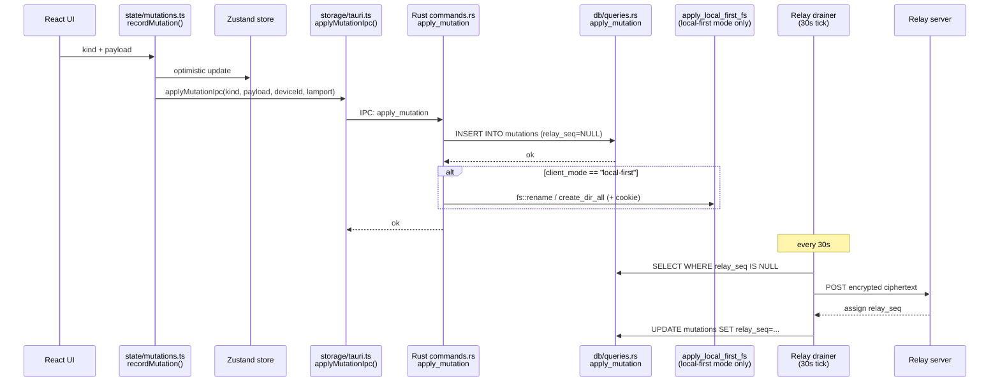

# CLAUDE.md — Nexus-V2 Agent Orientation

Quick orientation for AI coding agents and new contributors. Read this first; dive into `docs/architecture.md` and `docs/glossary.md` for deeper context.

---

## What is Nexus?

Nexus is a **local-first, privacy-focused email client for macOS** built with Tauri 2 (Rust backend) and React 18 (TypeScript frontend). All mail data lives in a local SQLite vault encrypted with SQLCipher. Cross-device sync is optional and E2EE via a self-hosted relay server.

Epics shipped so far: EP-0 (data model + filtering), EP-1 (workspace layouts + kanban), EP-2 (custom fields + notes), EP-3 (FTS + contacts), EP-4 (Tauri native shell + Gmail sync), EP-5 (E2EE relay — self-hosted only), EP-6 (multi-provider — Gmail, IMAP with real IDLE, Outlook OAuth, JMAP), EP-7 (FTS5 + rules engine + quick wins), EP-8 (iOS Swift app — **in progress**; 29 Swift files, shares vault format via relay sync, parity with desktop not yet verified), EP-9 (Google contacts sync), EP-10 (Google calendar sync — backend foundation), plus inter-epic improvements (ContactHoverCard, vCard import/export, tag sidebar navigation, 21-color label palette, email row right-click context menu, undo/redo with history modal), EP-11 (calendar foundation: Google Calendar sync, agenda view, event CRUD, per-calendar toggles), EP-12 (calendar field completeness: conference URLs, Drive attachments, per-event colors, Compose→Event flow), EP-13 (calendar event templates, week/month time-grid views, drag-to-reschedule).

> **For what's broken/unfinished, see `docs/known-gaps.md`** — single canonical register of stubs, partial implementations, and planned gaps. Read it before assuming a feature is "done".

---

## Essential Commands

```bash
# Frontend
pnpm dev              # Web-only Vite server on :1420 (no IPC, good for UI work)
pnpm typecheck        # TypeScript check — must pass before committing
pnpm lint             # ESLint zero-warnings — must pass before committing
pnpm test             # Vitest unit tests
pnpm test:watch       # Vitest watch mode

# Full desktop app (requires .env with Gmail creds)
pnpm tauri:dev        # Loads .env, starts Vite + Rust in watch mode
pnpm tauri:build      # Production .app bundle → src-tauri/target/release/bundle/

# Rust
cargo check -p nexus           # Tauri backend
cargo check -p nexus-relay     # Standalone relay binary
cargo test -p nexus            # Rust unit tests
```

---

## Repository Layout

```
Nexus-V2/
├── src/                        # React + TypeScript frontend
│   ├── App.tsx                 # Root: vault check → VaultSetup or Workspace
│   ├── data/types.ts           # ALL canonical types (Vault, Message, Mutation, etc.)
│   ├── state/
│   │   ├── mutations.ts        # recordMutation() — the single write path
│   │   └── workspace.ts        # Zustand UI state (theme, density, layout)
│   ├── storage/
│   │   ├── tauri.ts            # Typed IPC wrappers for all Rust commands
│   │   └── useStore.ts         # React hooks over the in-memory store
│   └── components/             # UI components (see docs/developer-guide.md)
├── src-tauri/src/              # Rust backend (28 .rs files, ~10.4K lines)
│   ├── lib.rs                  # AppState, plugin init, invoke_handler! registration (57 commands)
│   ├── commands.rs             # 57 IPC command implementations (~2.3K lines)
│   ├── crypto.rs               # XChaCha20-Poly1305 + BLAKE3 + enrollment code gen
│   ├── smtp.rs                 # SMTP send (used by IMAP/Outlook outbound)
│   ├── db/
│   │   ├── schema.rs           # SQLite DDL — 30 tables + 2 FTS5 virtual + 20+ indexes
│   │   ├── queries.rs          # ~89 query helpers (SELECT/INSERT/UPDATE) — see OptionalExt note below
│   │   └── mod.rs              # VaultDb struct + ALTER_SQL-style migration runner
│   ├── gmail/                  # 9 files: OAuth, History API sync, mutations, calendar, contacts
│   ├── providers/              # EP-6 multi-provider: imap.rs, imap_idle.rs (real IDLE + poll fallback),
│   │                           #   outlook_oauth.rs, autodiscovery.rs, jmap.rs + jmap_types.rs
│   ├── relay/                  # E2EE relay client + embedded server
│   └── watcher/                # Background file-system watcher (notify crate)
├── relay-server/               # Standalone nexus-relay binary
│   └── src/
│       ├── main.rs             # Entry point (reads RELAY_DB_PATH, RELAY_PORT)
│       ├── db.rs               # Relay SQLite schema + queries
│       └── routes.rs           # axum route handlers
└── docs/                       # Design specs and guides
    ├── architecture.md         # Canonical system design (read this for "why")
    ├── glossary.md             # Stable IDs for every concept (LBL, MSG, MUTN, etc.)
    ├── developer-guide.md      # How-to recipes for common dev tasks
    ├── user-guide.md           # End-user documentation
    ├── relay.md                # Relay setup guide (user-facing)
    └── UI-DESIGN-SYSTEM-SPEC.md  # Design tokens, component library spec
```

---

## Key Patterns

### The mutation pipeline

Every user intent flows through one path:



**Never write directly to the store or DB — always go through `recordMutation()`.**

### IPC commands

All **57 commands** are registered in `src-tauri/src/lib.rs:invoke_handler!` (lines 36-103, grouped by epic comments) and implemented in `src-tauri/src/commands.rs`. Every command has a typed wrapper in `src/storage/tauri.ts`.

For the full inventory grouped by feature area, see [`docs/ipc-api-reference.md`](docs/ipc-api-reference.md). Highlights by epic:

- **EP-6 (multi-provider):** `discover_imap_settings`, `test_imap_connection`, `add_imap_account`, `add_jmap_account`, `start_outlook_oauth`, `sync_account_now`, `disconnect_account`
- **EP-7 (rules/templates/FTS5):** `search_messages`, `get_rules`, `save_rule`, `delete_rule`, `get_templates`, `save_template`, `delete_template`, `send_unsubscribe`, `get_client_mode`, `set_client_mode`
- **EP-7 stage 4 (account prefs):** `get_account_preferences`, `save_account_preferences`, `get_signature_html`, `save_signature_html`, `get_vacation_responder`, `save_vacation_responder`, `delete_vacation_responder`
- **EP-9 (contacts sync):** `sync_google_contacts`
- **EP-10/11 (calendar):** `sync_google_calendar`, `create_calendar_event`, `update_calendar_event`, `get_calendar_list`, `search_calendar_events` — note: there is **no** `get_calendar_events` or `delete_calendar_event` IPC; events are hydrated by `load_vault_data` and deletion goes through the `DELETE_CALENDAR_EVENT` mutation.
- **EP-13 (event templates):** `get_event_templates`, `save_event_template`, `delete_event_template`

### Non-Send VaultDb across async

`VaultDb` wraps `rusqlite::Connection` which contains `RefCell<LruCache>` — it is **not `Send`**. You cannot hold a `&VaultDb` reference across an `.await` point in a Tokio task. Instead, pass a `db_path: &str` and open a fresh `VaultDb::open()` inside the async function after all await points.

```rust
// WRONG — future is not Send
async fn bad(db: &VaultDb) {
    do_something().await;
    db.query(); // compile error: VaultDb not Send
}

// CORRECT — open fresh connection
async fn good(db_path: &str) {
    do_something().await;
    let db = VaultDb::open(db_path).unwrap();
    db.query();
}
```

### OptionalExt conflict in queries.rs

`src-tauri/src/db/queries.rs` defines a local `OptionalExt` blanket impl that provides `.optional()` on `rusqlite::Result`. **Do NOT add `use rusqlite::OptionalExtension;`** anywhere in this file — both traits provide `.optional()` and Rust will raise E0034 (ambiguous method call). The local trait handles all cases automatically.

### Lamport clock + device ID

Every mutation is stamped with `deviceId` (stable per device, stored in `devices` table) and a `lamport` counter (monotonically increasing logical clock). These flow from `recordMutation()` → IPC → `mutations.device_id` / `mutations.lamport` columns. The relay uses them for causal ordering across devices.

### Local-First mode and filesystem synchronization

`AppState.client_mode: Mutex<String>` holds `"traditional"` or `"local-first"`. The value persists to `{vault_path}/.nexus-mode` on disk and is loaded by `read_client_mode()` at startup and on every background poll.

In `"local-first"` mode, `apply_mutation` in `commands.rs` runs DB writes **then** calls `apply_local_first_fs()` for filesystem side-effects:
- `MOVE_TO_FOLDER` → `fs::rename(.eml)` to the new folder directory
- `RENAME_FOLDER` → `fs::rename(directory)` + bulk UPDATE of `eml_path` in DB
- `CREATE_FOLDER` → `fs::create_dir_all`

Expected FS changes are tagged with a cookie so the `notify` watcher ignores them and doesn't generate duplicate mutations.

In `"traditional"` mode only the DB is written; no filesystem side-effects occur.

The `GmailSyncer` (and all sync workers) receive `client_mode` at construction time and call `write_eml_file()` inside the DB transaction for every newly inserted message when in local-first mode.

**Frontend**: `VaultSetup.tsx` has a three-step onboarding flow: vault path → mode selection (Traditional / Local-First) → connect account. `setClientModeIpc(mode)` is called on selection and again in `handleVaultContinue` for returning users (via `loadClientMode()` from `src/lib/clientMode.ts`).

---

## Environment Setup

```bash
cp .env.example .env
# Edit .env and fill in:
# NEXUS_GMAIL_CLIENT_ID=your-client-id.apps.googleusercontent.com
# NEXUS_GMAIL_CLIENT_SECRET=your-client-secret
```

Gmail OAuth requires a Google Cloud project with the Gmail API enabled and `http://localhost` (no port number) added as an authorized redirect URI. See `docs/developer-guide.md` for full setup steps.

---
## General Rules

### 1. Think Before Coding

**Don't assume. Don't hide confusion. Surface tradeoffs.**

Before implementing:
- State your assumptions explicitly. If uncertain, ask.
- If multiple interpretations exist, present them - don't pick silently.
- If a simpler approach exists, say so. Push back when warranted.
- If something is unclear, stop. Name what's confusing. Ask.

### 2. Simplicity First

**Minimum code that solves the problem. Nothing speculative.**

- No features beyond what was asked.
- No abstractions for single-use code.
- No "flexibility" or "configurability" that wasn't requested.
- No error handling for impossible scenarios.
- If you write 200 lines and it could be 50, rewrite it.

Ask yourself: "Would a senior engineer say this is overcomplicated?" If yes, simplify.

### 3. Surgical Changes

**Touch only what you must. Clean up only your own mess.**

When editing existing code:
- Don't "improve" adjacent code, comments, or formatting.
- Don't refactor things that aren't broken.
- Match existing style, even if you'd do it differently.
- If you notice unrelated dead code, mention it - don't delete it.

When your changes create orphans:
- Remove imports/variables/functions that YOUR changes made unused.
- Don't remove pre-existing dead code unless asked.

The test: Every changed line should trace directly to the user's request.

### 4. Goal-Driven Execution

**Define success criteria. Loop until verified.**

Transform tasks into verifiable goals:
- "Add validation" → "Write tests for invalid inputs, then make them pass"
- "Fix the bug" → "Write a test that reproduces it, then make it pass"
- "Refactor X" → "Ensure tests pass before and after"

For multi-step tasks, state a brief plan:
```
1. [Step] → verify: [check]
2. [Step] → verify: [check]
3. [Step] → verify: [check]
```

Strong success criteria let you loop independently. Weak criteria ("make it work") require constant clarification.

---

**These guidelines are working if:** fewer unnecessary changes in diffs, fewer rewrites due to overcomplication, and clarifying questions come before implementation rather than after mistakes.

## Where to Find Things

| What | Where |
|------|-------|
| All data types (Vault, Message, Label, Mutation, …) | `src/data/types.ts` |
| MutationKind enum (72 kinds) | `src/data/types.ts` → `MutationKind` |
| IPC command reference (all 56) | `docs/ipc-api-reference.md` |
| Database schema reference (30 tables + ERD) | `docs/database-reference.md` |
| Security model (vault + relay + enrollment) | `docs/security-model.md` |
| What's broken/unfinished | `docs/known-gaps.md` |
| DB table definitions | `src-tauri/src/db/schema.rs` |
| All IPC command implementations | `src-tauri/src/commands.rs` |
| IPC command registration | `src-tauri/src/lib.rs` → `invoke_handler!` |
| Typed frontend IPC wrappers | `src/storage/tauri.ts` |
| Zustand UI state | `src/state/workspace.ts` |
| App-global preferences (notifications, undo-send, etc.) | `src/lib/appPreferences.ts` |
| Keyboard shortcut registry + rebinding helpers | `src/lib/shortcuts.ts` |
| Per-workspace snapshot persistence | `src/storage/workspaceManager.ts` |
| Design tokens (colors, spacing, typography) | `docs/UI-DESIGN-SYSTEM-SPEC.md` |
| Terminology / stable IDs (LBL, MSG, etc.) | `docs/glossary.md` |
| Architecture rationale and commitments | `docs/architecture.md` |
| Epic feature checklists | `docs/epic-{0,1,2,3,4,5,6,7,8,11,12,13}-checklist.md` |
| Calendar color map (Google colorId → hex) | `src/lib/calendarColors.ts` → `eventColor()` |
| Calendar date/grid utilities | `src/lib/calendarUtils.ts` |
| Calendar view components | `src/components/calendar/` |
| vCard import/export | `src/lib/vcard.ts` → `parseVcf`, `serializeVcf` |
| Sender/participant hover card | `src/components/contacts/ContactHoverCard.tsx` |
| Contact message history hook | `src/storage/useStore.ts` → `useContactMessages()` |

---

## Known Gotchas

**macOS 15 crash (tao/MainThreadMarker):** The `src-tauri/Cargo.toml` patches the `tao` crate to fix a crash on macOS 15 where Tauri's window management accesses AppKit off the main thread. Do not remove this patch.

**SQLCipher vs plain SQLite:** The Tauri vault uses `rusqlite` with the `bundled-sqlcipher` feature (encrypted SQLite). The relay server uses plain `rusqlite` with `bundled` (no encryption — relay stores only ciphertext blobs, so disk encryption would be redundant). Do not mix these.

**Gmail OAuth redirect URI:** The local OAuth flow listens on a random ephemeral port. You need `http://localhost` (without a specific port) added as an authorized redirect URI in your Google Cloud Console project, or Gmail auth will fail with `redirect_uri_mismatch`.

**pnpm workspace:** This is a pnpm workspace. Always run `pnpm install` from the root, not inside subdirectories. The `relay-server/` Rust crate is a separate Cargo workspace (its own `Cargo.lock`), not part of the root pnpm workspace.

**Rules/Templates mutation pipeline:** Rules and templates must be saved via `saveRuleMutation()` / `saveTemplateMutation()` / `deleteRuleMutation()` / `deleteTemplateMutation()` in `src/state/mutations.ts` — NOT by calling the IPC functions directly. Direct IPC calls bypass the local store and the relay queue.

**EmailViewerPanel rendering:** The email body is rendered by the `EmailBody` component using `contentDocument.write()` + `ResizeObserver` for reliable iframe sizing and DOMPurify sanitization. The `bodyHtml` state is `string | null` — `null` = loading, `""` = no body (show snippet), string = render. Do not revert to `srcDoc`/`onLoad` — that pattern broke image blocking and produced layout pop-in.

**Event templates mutation pipeline:** Event templates must be saved via `saveEventTemplateMutation()` / `deleteEventTemplateMutation()` in `src/state/mutations.ts` — NOT by calling the IPC functions directly. Follows the same pattern as email templates (`TMPL`).

**Drag-to-reschedule and recurring events:** `WeekView` and `MonthView` allow dragging an event only when it is a locally-expanded occurrence (`masterId` set) or a plain non-recurring event — `draggable={!!evt.masterId || (!evt.recurringEventId && !evt.rrule)}`. A locally-expanded occurrence reschedules through `editEventOccurrence` (inline exception + EXDATE), **never** through the `UPDATE_CALENDAR_EVENT` timestamp-swap, which corrupts the series. Two cases stay non-draggable on purpose: a raw recurring **master** (`rrule` set, not expanded) and a **Google-expanded** instance (`recurringEventId` but no local `masterId`, so there is no master to except). Do not route recurring instances back through `rescheduleCalendarEvent`/`UPDATE_CALENDAR_EVENT`.

**updateCalendarEvent IPC takes `externalId`:** The `updateCalendarEvent` IPC function identifies events by `externalId` (the Google Calendar event ID), not by the internal Nexus `id`. Using `id` here will silently fail to push the change to Google.

**Tag pseudo-folder IDs:** Tags in the navigation sidebar use the synthetic `selectedFolderId = "tag:<name>"` pattern. `useVisibleMessagesForPanel` and `useSelectionTitle` resolve these pseudo-IDs. Do not pass real folder UUIDs for tag navigation.

---

## Known Incomplete (read `docs/known-gaps.md` for the full register)

- **EP-8 iOS parity** is in progress and unaudited — 29 Swift files, ~15 UI screens, no measured coverage vs. the desktop feature set.

---

## Branch Convention

Feature branches follow `claude/nexus-ep<N>-<description>-<id>` (e.g., `claude/nexus-ep3-execution`). Development for a given session happens on the designated branch; check the session instructions for which branch to use.
