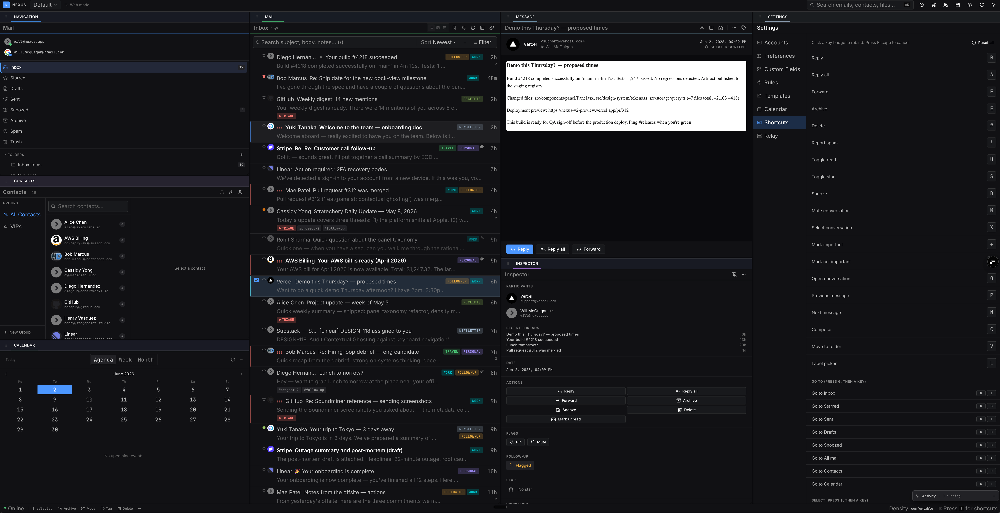
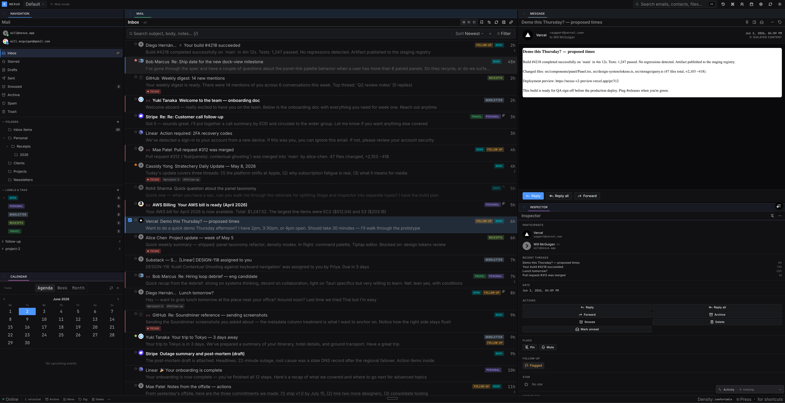
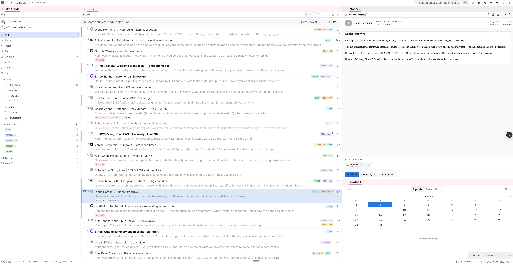

# Nexus

**A local-first, privacy-focused email client for macOS.**

> All your mail stays on your machine. Organize it the way you think — not the way your email provider thinks.

---

## What is Nexus?

Nexus is a native macOS desktop client for email, calendar, and contacts, built on [Tauri](https://tauri.app) (Rust) and React. Every message, event, contact, label, tag, and annotation lives in a local SQLite vault on your disk — no cloud account required, no data leaves your machine unless you opt into E2EE relay sync.

Where other email clients give you folders and stars, Nexus gives you a full metadata layer: labels, tags, workflow status, priority, snooze dates, free-form notes, and unlimited custom fields — all filterable, sortable, and searchable in milliseconds on a local FTS5 index.

---

## Features

- **Multi-provider mail** — Connect Gmail (OAuth 2.0, incremental Gmail History API sync), any IMAP account (with real IDLE push and a poll fallback), Outlook (OAuth), or a JMAP server (Fastmail, Stalwart). Outbound mail goes through SMTP for IMAP/Outlook. Your local annotations never touch the provider.
- **Calendar** — Google Calendar sync with agenda, week, and month views, event create/update/delete, recurring-event editing, drag-to-reschedule, per-calendar toggles, and reusable event templates.
- **Contacts** — Google Contacts sync, vCard import/export, contact hover cards, and per-contact message history.
- **Dockable panel layout** — Every panel (mail list, reader, inspector, calendar, contacts, settings) is resizable and rearrangeable. Save layouts per workspace.
- **Multi-axis metadata** — Labels, tags, workflow status, priority (1–4), stars, flag/snooze dates, inline markdown notes, and unlimited custom fields (text, number, date, select, multi-select, boolean, URL, person…).
- **Rules & templates** — Automatic message triage with a rules engine, plus reusable message and event templates.
- **Kanban + table views** — Toggle between list, table, and kanban views grouped by any axis.
- **Full-text search** — SQLite FTS5 index over subject and notes. Sub-10ms results on 100k+ message vaults.
- **Command palette** — `⌘K` to find any action, navigate any view, or jump to any message.
- **E2EE cross-device sync** — Optional self-hosted relay server. Mutations are encrypted with XChaCha20-Poly1305 before leaving your device; the relay sees only opaque ciphertext. See [docs/relay.md](docs/relay.md).
- **No cloud required** — Run entirely offline. Add relay sync only if you want it.

---

## Screenshots

**Dockable multi-panel workspace (dark theme)** — navigation, mail list, message reader, and settings side by side.



**Message reader with metadata inspector (dark theme)** — view a message alongside its labels, tags, workflow status, and custom fields.



**Light theme with inline calendar** — the same workspace in light mode, with the calendar agenda docked beside the reader.



---

## Getting Started

### Prerequisites

| Tool | Minimum version |
|------|----------------|
| macOS | 13 Ventura |
| Node.js | 20 |
| Rust | 1.77 |
| pnpm | 8 |

Install Rust via [rustup](https://rustup.rs). Install pnpm via `npm install -g pnpm` or [pnpm.io](https://pnpm.io).

### Install

```bash
git clone https://github.com/wdsmcguigan/nexus-v2.git
cd nexus-v2
pnpm install
```

### Configure Gmail OAuth

Nexus syncs Gmail via the official Gmail API. You'll need a Google Cloud project with the Gmail API enabled:

1. Go to [console.cloud.google.com](https://console.cloud.google.com) → Create project
2. Enable the **Gmail API**
3. Create OAuth 2.0 credentials (Desktop app type)
4. Add `http://localhost` as an authorized redirect URI
5. Copy your credentials:

```bash
cp .env.example .env
# Edit .env:
NEXUS_GMAIL_CLIENT_ID=your-client-id.apps.googleusercontent.com
NEXUS_GMAIL_CLIENT_SECRET=your-client-secret
```

### Run

```bash
pnpm tauri:dev
```

This starts the Vite dev server and the Tauri app in watch mode. On first launch, Nexus will ask you to create a vault (choose a folder on your disk) before connecting your Gmail account.

To develop the frontend without the desktop shell:

```bash
pnpm dev   # Vite only, runs at http://localhost:1420
```

---

## Architecture

Nexus is a three-layer stack:

**Frontend (React + TypeScript):** A Vite-built React application running inside the Tauri WebView. All user intent flows through a single mutation pipeline: `recordMutation(kind, payload)` in `src/state/mutations.ts` applies changes optimistically to an in-memory store and dispatches them to the Rust backend via Tauri IPC. State is managed with Zustand; the dockable layout uses dockview.

**Backend (Rust + Tauri):** A Tokio async runtime handling 57 IPC commands exposed to the frontend (see [docs/ipc-api-reference.md](docs/ipc-api-reference.md)). The local vault is a SQLite database (encrypted with SQLCipher) at a user-chosen path. Provider sync (Gmail, IMAP, Outlook, JMAP) runs as background Tokio tasks — Gmail uses the History API for incremental updates and IMAP uses real IDLE with a poll fallback. All writes go through the `mutations` table first, which doubles as the relay outbound queue.

**Relay (optional, self-hosted):** An axum HTTP server (`nexus-relay`) that forwards encrypted mutation blobs between devices. The relay is zero-knowledge: it stores only XChaCha20-Poly1305 ciphertext and never has access to the vault key. New devices are enrolled via a 6-digit time-limited code. See [docs/architecture.md](docs/architecture.md) for the full design.

---

## Cross-Device Sync

Nexus includes an optional E2EE sync relay. Run `nexus-relay` on any machine you control (your own server, a VPS, or even the same Mac) and configure its URL in **Settings → Relay**. Mutations are encrypted before leaving your device; the relay forwards opaque blobs and cannot read them.

See [docs/relay.md](docs/relay.md) for setup instructions including Tailscale, VPS, and same-Mac options.

---

## Development

See [docs/developer-guide.md](docs/developer-guide.md) for:
- Full environment setup
- How to add a new mutation kind
- How to add a new IPC command
- Database schema reference
- Testing and linting

---

## Documentation

| Document | Audience | Description |
|----------|----------|-------------|
| [docs/user-guide.md](docs/user-guide.md) | End users | How to use Nexus |
| [docs/relay.md](docs/relay.md) | End users | Setting up cross-device sync |
| [docs/CONTRIBUTING.md](docs/CONTRIBUTING.md) | Contributors | How to contribute |
| [docs/developer-guide.md](docs/developer-guide.md) | Engineers | Development how-to recipes |
| [docs/architecture.md](docs/architecture.md) | Engineers | System design and rationale |
| [docs/ipc-api-reference.md](docs/ipc-api-reference.md) | Engineers | All 57 Tauri IPC commands |
| [docs/database-reference.md](docs/database-reference.md) | Engineers | SQLite schema and ERD |
| [docs/security-model.md](docs/security-model.md) | Engineers | Vault, relay, and enrollment security |
| [docs/glossary.md](docs/glossary.md) | Engineers | Canonical terminology (LBL, MSG, MUTN, …) |
| [docs/UI-DESIGN-SYSTEM-SPEC.md](docs/UI-DESIGN-SYSTEM-SPEC.md) | Engineers | Design tokens and component library |
| [docs/roadmap.md](docs/roadmap.md) | Everyone | What's planned next |
| [docs/known-gaps.md](docs/known-gaps.md) | Everyone | What's broken, partial, or planned |
| [CLAUDE.md](CLAUDE.md) | AI agents | Codebase orientation for coding agents |

---

## License

_License TBD._
