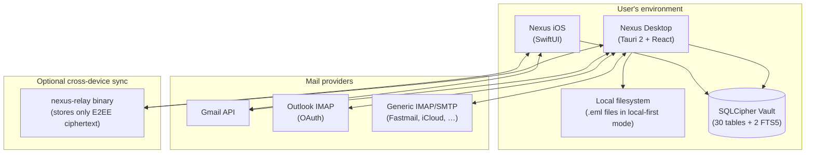
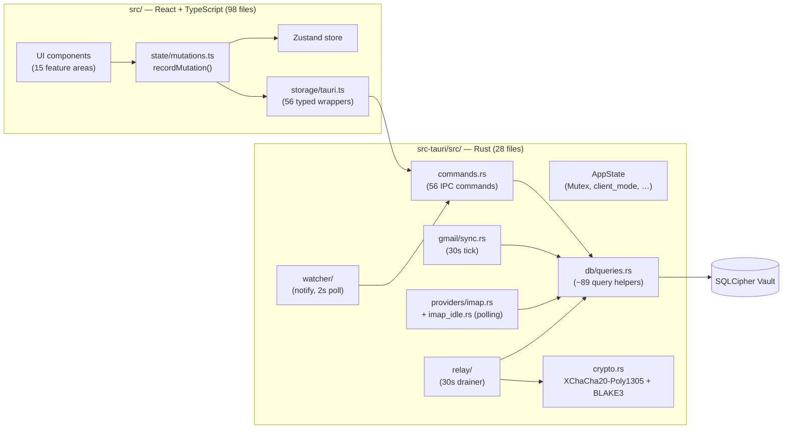
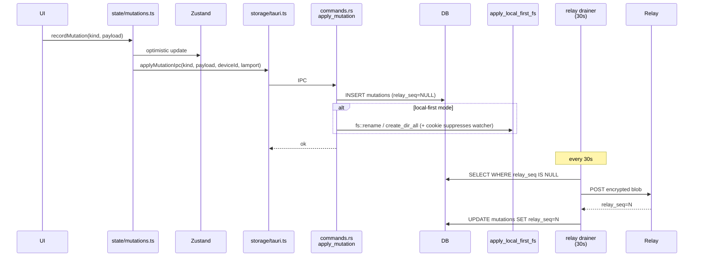
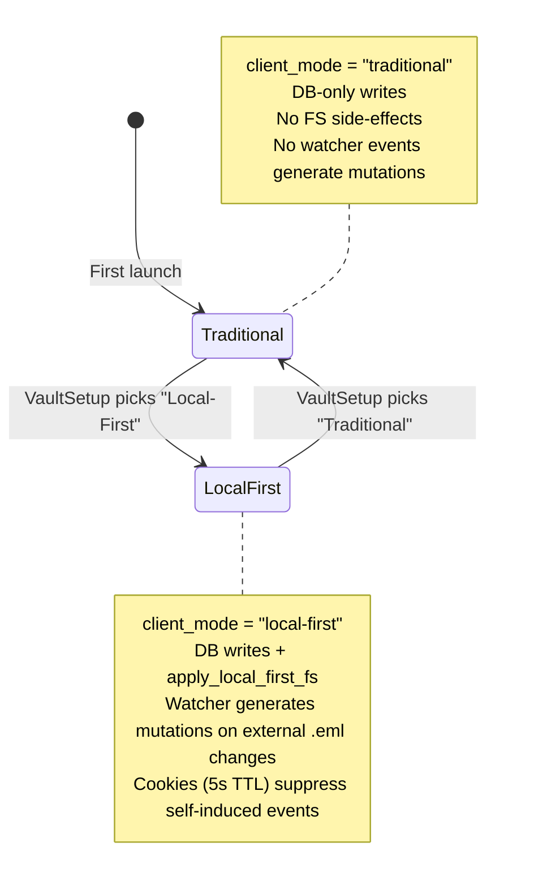

# NEXUS — Architecture

**Status:** v0.1 living reference
**Audience:** Engineers + agents working on NEXUS
**Scope:** Data model, indexing, storage layout, sync engine, security
model, and the epic roadmap

This is the **canonical architecture spec**. Terminology and stable IDs
are defined in `docs/glossary.md` — when you read an ID like `LBL` or
`INS-STATUS-PICKER`, look it up there. The concrete next-iteration
execution plan lives in `docs/epic-0-checklist.md`.

---

## 1. Why this exists

NEXUS today has a minimal in-memory fixture model: a flat folder list
(`fixtures.ts:38-89`), `labels: Label[]` per email, no nesting, no CRUD,
no persistence, no sync, no provider integration. `Account.syncStatus`
exists but is decorative.

We must commit to a real organizational architecture before we write any
more features that touch data shape. The architectural commitments below
are non-negotiable; the **phasing** of how we deliver them is flexible.

---

## 1.5 System at a glance (diagrams)

Four mermaid diagrams that compress the rest of this document into one screen each. Read these first; the prose below justifies the shapes.

### System context



### Container diagram (desktop)



### Outbound mutation pipeline



### Client-mode state



Mode is persisted to `{vault_path}/.nexus-mode` and held in `AppState.client_mode: Mutex<String>`.

---

## 2. Architectural commitments

1. **Folders (`FLD`) are local file structure** — bidirectional with the
   user's native file browser. App move ↔ Finder/Files move. Maildir-style:
   each email is an `.eml` file in a real directory.
2. **Labels (`LBL`) are organizational metadata** — many-to-many,
   color-coded, nestable, picked from a managed list. JMAP-mailbox-equivalent.
3. **Tags (`TAG`) are lightweight atomic annotations** — distinct from
   labels. Free-form `#hashtag` strings. No color, no hierarchy.
4. **`STA`, `PRI`, `STR`, `FLG`, `PIN`, `MUT`, `NTE` are first-class
   distinct fields** — each with its own data shape, index, and dedicated
   UI. Built for power users who want Airtable-grade expressivity for email.
5. **`CFD` (custom fields) are unlimited** — Airtable-style. User defines
   fields with types. Each is filterable + sortable. Indexed for fast
   `includes` filter performance.
6. **System nav items** (Inbox/Sent/Trash/Archive/Snoozed/Drafts/Starred)
   are **labels** (`LBL` with `kind = "system"`), not folders. Gmail/JMAP semantics.
7. **Cross-device sync** — desktop + mobile share state through an
   always-on sync relay. Mobile can read & send mail even with desktop offline.
8. **Zero-knowledge E2EE end-game** — architect for it from day one;
   ship pragmatically.
9. **Search must be Soundminer-fast** — local FTS index, not
   server-roundtripped. All metadata axes are indexed for sub-10ms
   multi-axis `includes` filtering on 100k+ message vaults.
10. **Provider integration** — Gmail (API + JMAP fallback), Fastmail /
    Apple / others (JMAP), legacy (IMAP). Provider-foreign metadata
    (`STA`/`PRI`/`CFD`/`STR`/`TAG`/`NTE`) is NEXUS-local; only `LBL` +
    `\Flagged` + `\Seen` sync to providers.
11. **Client mode flexibility** — Two orthogonal sync models, selectable
    per vault: `"traditional"` (cloud-first; Gmail/IMAP as primary source of
    truth) and `"local-first"` (disk-first; Maildir `.eml` tree is canonical,
    mutations drive both DB and filesystem). Choice persists to
    `{vault_path}/.nexus-mode`. Both modes share the same schema and mutation
    log; mode only affects whether FS side-effects fire in `apply_mutation`.

---

## 3. Reference systems we're learning from

- **JMAP (RFC 8621)** — modern email protocol. Messages have
  `mailboxIds: { id: true, ... }` allowing multi-mailbox membership.
  Canonical "label" semantic in the standards world. Used by Fastmail,
  Apache James, Stalwart, Cyrus, Thunderbird. We adopt JMAP's data model
  internally.
- **Gmail API + X-GM-LABELS IMAP extension** — Gmail's underlying model
  is identical to JMAP (multi-label messages); IMAP exposes labels as
  folders for compatibility.
- **Notmuch + Maildir** — proven model where Maildir is canonical (one
  file per email, real dirs as folders) and a sidecar Xapian index holds
  tags. We use the same shape: Maildir on disk + SQLite/FTS5 sidecar.
- **Mimestream** — validates that direct provider APIs beat IMAP for
  performance & feature fidelity.
- **Obsidian** — vault model with real folders on disk + a `.obsidian/`
  sidecar. Bidirectional FS watcher with conflict resolution. Validates
  the "one canonical FS layout + app-managed sidecar" approach.
- **Replicache** — operational sync engine. Mutations as opaque payloads
  → E2EE-friendly. Fits single-user-multi-device perfectly.
- **Tuta** — zero-knowledge encrypted email + encrypted search index.
  Validates that E2EE search is achievable.
- **Tauri 2** — native FS watcher via the `notify` crate;
  capability-based permissions; ~10MB binaries vs Electron's ~150MB.

---

## 4. Data model

See `src/data/types.ts` (Epic 0) for the authoritative TypeScript. The
shape below is illustrative.

```ts
// Vault metadata (one per user)
type Vault = { id, path, createdAt, masterKeySalt };

// Folder = real dir. Hierarchy via parentId.
type Folder = {
  id, vaultId, parentId | null,
  name,                  // displayed; may differ from on-disk slug
  diskSlug,              // sanitized dir name
  diskPath,              // resolved cache: "Personal/Receipts/2026"
  color?, icon?,
  systemKind?: "outbox" | "trash-bin" | null,
};

// ───── Metadata-axis tables (one per axis) ─────

// LBL — organizational taxonomy (multi-value, color, nestable)
type Label = {
  id, vaultId, name,
  color: 1..8,
  kind: "system" | "user",
  systemKind?: "inbox" | "sent" | "drafts" | "trash" | "archive" | "snoozed" | "starred" | "important",
  parentId?: string | null,
  position: number,
};

// STA — single-select workflow state
type Status = {
  id, vaultId, name,
  color: 1..8,
  position: number,
  isDefault?: boolean,
  isTerminal?: boolean,
};

// CFD — custom-field definition (Airtable-style, unlimited)
type CustomFieldDef = {
  id, vaultId, name,
  type: "text" | "longtext" | "number" | "date" | "datetime"
      | "url" | "email" | "boolean"
      | "select" | "multi-select" | "person",
  options?: { id, label, color: 1..8, position }[],
  description?: string,
  position: number,
  isPinned?: boolean,
  defaultValue?: unknown,
};

// TGU — tag-usage index (for autocomplete + global rename)
type TagUsage = { vaultId, tag: string, count: number, lastUsedAt };

// ───── Message ─────

type Message = {
  id,
  vaultId,
  folderId,                    // exactly one — disk location
  threadId,
  providerIds: { gmail?, jmap?, imapUid?, messageId },

  // Each metadata axis is a distinct, indexed field:
  labelIds: string[],          // many — LBL
  tags: string[],              // many — TAG (atomic strings)
  statusId: string | null,     // one — STA
  priority: 1 | 2 | 3 | 4 | null, // PRI
  star: StarStyle | null,      // STR
  flag: FlagState | null,      // FLG
  pinned: boolean,             // PIN
  muted: boolean,              // MUT
  notes: string | null,        // NTE markdown
  customFields: { [defId: string]: CustomFieldValue },

  // RFC 9051 keywords (provider-portable)
  flags: { read, answered, draft, flagged },

  // Envelope
  receivedAt, sentAt,
  fromAddr, toAddrs, ccAddrs, bccAddrs,
  subject, snippet,
  bodyRef,                     // hash; body lives on disk
  attachmentRefs[],
};

type StarStyle =
  | "yellow" | "red" | "orange" | "green" | "blue" | "purple"
  | "check-green" | "bang-red" | "question-purple"
  | "guillemet-orange" | "info-blue" | "bang-yellow";

type FlagState = {
  setAt: number,
  dueAt?: number,
  reminderAt?: number,
  completedAt?: number | null,
};

type CustomFieldValue =
  | string | number | boolean | Date
  | string[]                   // multi-select option ids
  | { type: "person", addr: string, name?: string }
  | null;

// ───── Automation ─────

type Rule = {
  id, vaultId, name, enabled: boolean, position: number,
  conditions: RuleCondition[],
  conditionLogic: "AND" | "OR",
  actions: RuleAction[],
};

type Template = {
  id, vaultId, name,
  subject: string,
  bodyHtml: string,
  createdAt: number,
};

// ───── Calendar (EP-11) ─────

// CAL — one per connected Google Calendar
type Calendar = {
  id, vaultId, accountId,
  externalId,              // Google Calendar ID
  name,
  color?,
  enabled: boolean,        // user-controlled visibility toggle
};

// EVT — single calendar event instance (singleEvents=true pre-expanded; EP-11/EP-12)
type CalendarEvent = {
  id, vaultId, accountId, calendarId,
  externalId,              // Google event ID (used by updateCalendarEvent IPC)
  iCalUID?,                // RFC 5545 stable UID
  recurringEventId?,       // parent recurring event ID; drag-to-reschedule disabled when set

  title, startTs, endTs, allDay,
  description?, location?,
  attendees: CalendarAttendee[],
  organizerEmail?, creatorEmail?,

  // EP-12 additions
  colorId?,                // Google colorId "1"–"11"; see src/lib/calendarColors.ts
  conferenceUrl?,          // Google Meet / Zoom join URL
  visibility?,             // "default"|"public"|"private"|"confidential"
  transparency?,           // "opaque"|"transparent"
  reminders?,              // CalendarReminder[] — override defaults
  attachments?,            // CalendarAttachment[] — Drive files, display-only

  status?,                 // "confirmed"|"tentative"|"cancelled"
  notes?,                  // local-only markdown annotation (not synced to Google)
  createdAt, updatedAt,    // from Google timestamps, not sync time
};

// ETMPL — reusable event preset (EP-13)
type EventTemplate = {
  id, vaultId, name,
  title, description?, location?,
  durationMinutes: number,
  defaultAttendees: string[],
  createdAt,
};

// ───── Mutation log (the sync substrate) ─────

type Mutation = {
  id, vaultId, deviceId, ts, lamport,
  kind: <see docs/glossary.md §8 for the canonical list>,
  payload: <encrypted blob in E2EE mode>,
};
```

---

## 5. Indexing strategy

Search/filter speed is the headline power-user feature. Every metadata
axis is indexed at write time so any arbitrary intersection
(e.g. `LBL=Work AND STA=Awaiting Reply AND PRI≤2 AND CFD.Project=Acme AND TAG=urgent`)
returns instantly.

- **Labels (m:n)** → `messages_labels(message_id, label_id)` join;
  composite `(label_id, message_id)` for "messages with this label"
  + reverse `(message_id, label_id)` for "labels of this message".
- **Tags (m:n)** → `messages_tags(message_id, tag)` denormalized;
  index `(tag, message_id)`; `tag_usage(tag)` for autocomplete + rename.
- **Status / Priority / Star / Pinned / Muted / Read** → direct columns
  on `messages` with single-column indexes; covering indexes
  `(status_id, received_at)`, `(priority, received_at)` for sorted views.
- **Flag** → indexed `flag_due_at`, `flag_completed_at` for "due this week"
  / "open follow-ups".
- **Custom fields** → EAV table
  `custom_field_values(message_id, field_id, value_text, value_number, value_date, value_bool)`
  with composite indexes `(field_id, value_text)`, `(field_id, value_number)`,
  `(field_id, value_date)`. Multi-select → multiple rows. EAV beats
  JSON-column extraction in SQLite for arbitrary filter predicates.
- **Notes** → joined into FTS5 alongside subject + body (Epic 3) so
  notes are searchable globally.
- **All `*_id` foreign keys** → `ON DELETE CASCADE`.

A `queryMessages(filter: MetadataFilter)` helper (`WF-SEARCH-QUERY`)
composes these into a single SQL query with parametrized predicates;
the same shape powers list views (`VW-LIST`), the command palette
(`PAL-COMMAND`), saved-view storage (`VW-SAVED`, Epic 1), and future
kanban (`VW-KANBAN-BY-STATUS`) + table (`VW-TABLE-CUSTOM-FIELDS`) views.

---

## 6. Storage layout on disk (Tauri/desktop)

```
~/Mail/                                     ← vault root (configurable)
  Inbox stuff/                              ← user folder
    Bob — Re Ship date — 20260510-1605.eml
    ...
  Personal/
    2026/
      Receipts/
        ...
  Sent items/                               ← also a user folder
  .nexus/                                   ← canonical sidecar (do not edit)
    db.sqlite                               ← Folders, Labels, Statuses, Messages, CFD defs, CFV, indexes
    fts/                                    ← Tantivy or SQLite-FTS5 (Epic 3)
    mutations.log                           ← outbound queue (encrypted)
    keys/                                   ← key material (OS-keychain backed)
    providers/<account-id>/state.json       ← provider sync cursors
    cache/bodies/<hash>.eml                 ← deduplicated body cache
  .nexus-trash/                             ← user-deletable; soft-delete bin
```

**Why `.eml` files in user folders + sidecar DB:**
- Finder/Files visibility (files appear with native icons + Quick Look works).
- User can move files between folders manually (FS watcher reconciles).
- User can backup by copying the folder.
- Labels/threads/flags need fast queries → DB is the right home for them.
- Search index is rebuildable from the .eml + DB at any time.

**System labels do NOT manifest as folders on disk.** A message with the
`inbox` label still lives in whatever user folder it landed in. Default
inbound location: `Inbox stuff/<year>/<month>/...`, but the user can
move it anywhere; the label persists. JMAP model.

**Web (Epic 0)** uses an in-memory `LocalStore` (plain TypeScript class,
`Map`-based inverted indexes) instead of OPFS/SQLite. OPFS persistence is
deferred to EP-3/4. The logical schema is identical; `hydrate()` seeds from
fixture data at startup and the mutation log is in-memory only.
React components subscribe via `useSyncExternalStore` against
`LocalStore.subscribe()` / `version`-increment pattern.

---

## 7. Sync engine — Replicache, layered for E2EE

- **Local store**: SQLite as source of truth on each device. Schema
  mirrors §4. WAL mode + full-text via FTS5 (Epic 3).
- **Mutation log**: every user action writes a `MUTN` to local WAL →
  applied optimistically → enqueued for sync. Same model as Linear's
  sync engine.
- **Sync relay (Epic 5)**: NEXUS-hosted server. Stores mutations as
  opaque ciphertext, orders per-vault by Lamport timestamp, broadcasts
  deltas. Payloads are E2EE — server cannot decrypt.
- **Provider intake (Epic 6)**: a "provider worker" runs in each
  vault's host (desktop daemon, mobile background task, or NEXUS
  server-side as fallback). Polls Gmail/JMAP/IMAP, generates
  `RECEIVE_FROM_PROVIDER` mutations, encrypts, ships to relay.
- **Conflict resolution (Epic 8)**: mutations are mostly commutative
  (label add/remove). For moves & renames, last-write-wins by
  `(lamport, deviceId)`. Folder rename of a deleted folder = no-op.
  Concurrent rename = both names recorded; user gets `WSP-CONFLICT-CHIP`.
- **Outbox**: pending mutations indicate sync state; offline writes
  queue here; UI shows pending count.

**Why Replicache over ElectricSQL** (despite intuition for raw SQL):
Replicache treats payloads as opaque, which makes E2EE clean.
ElectricSQL's Postgres replication needs schema-level visibility, which
fights zero-knowledge. Search speed is decoupled from sync — both
architectures use a local SQLite + FTS index, so Soundminer-class search
is achievable either way.

**Mobile-without-desktop**: critical requirement. The relay is the
always-on path. Mobile syncs with the relay directly; provider workers
run server-side or in a mobile background task. Desktop is NOT in the
loop for mobile to receive or send. When desktop comes back online it
pulls the same mutation stream + reconciles its on-disk Maildir via the
FS watcher.

---

## 8. Bidirectional native-FS reflection (desktop, Epic 4)

Two flows must coexist without infinite loops:

1. **`WF-FS-RECONCILE-APP-TO-DISK`**: app op writes the mutation, then
   performs the FS op (`fs.rename` of the .eml file). Tag the FS op with
   a short-lived "expected change" cookie so the watcher ignores it.
2. **`WF-FS-RECONCILE-DISK-TO-APP`**: `notify` (Tauri) detects a manual
   move/rename → reconciler resolves the affected `MSG`(s) by content
   hash → emits equivalent mutation(s) → applies + syncs.

Edge cases handled explicitly:
- Drag-in from Finder → ingest as new `MSG` (parse `.eml`, infer
  envelope, no provider id).
- Finder delete → soft-delete (move to `.nexus-trash/`), emit
  `DELETE_MESSAGE`.
- Finder folder rename → rename `FLD`; child paths update; mutation propagates.
- Concurrent rename across devices → LWW + `WSP-CONFLICT-CHIP`.

iOS/Android (Epic 7) use FileProvider / DocumentsProvider extensions:
vault appears in Files app; same reconciler logic, OS-mediated.

---

## 9. Provider adapters (EP-6, shipped)

Four adapters are shipped. All generate `RECEIVE_FROM_PROVIDER` mutations on inbound; outbound flows through the provider's send API.

- **Gmail API** — first-class. OAuth 2.0; tokens in macOS Keychain. Initial
  sync via `messages.list` + `messages.get`; incremental via History API
  (`historyId` cursor). MIME parsed in Rust. Maps Gmail labels ↔ NEXUS `LBL`.
  Push-back: `messages.modify` for label changes; archive/trash via label ops.
- **IMAP/SMTP** (shipped EP-6) — autodiscovery via MX + provider lookup; falls
  back to manual config. **IMAP IDLE is not yet real**: `providers/imap_idle.rs:start_idle_watcher` is a 30-second polling loop, despite its name. TLS / STARTTLS / plain
  SMTP for outbound. Each IMAP folder maps to a NEXUS `FLD` + `LBL`. Credentials
  stored in Keychain. See `docs/known-gaps.md` item 3.
- **Outlook / Microsoft 365** (shipped EP-6) — Microsoft OAuth 2.0; account auto-
  configured for IMAP/SMTP after auth. Same IMAP/SMTP sync path underneath.
- **JMAP** (Fastmail, Stalwart, Apache James) — 🟡 **stub only**. Every method in
  `providers/jmap.rs` returns `Err(anyhow!("JMAP coming in EP7"))`. The `AddAccountModal` JMAP card is correctly marked disabled. Implementation deferred — see `docs/known-gaps.md` item 2.

Push-back to provider (`WF-LABEL-PROVIDER-SYNC`):
- Gmail: `messages.modify`; folder moves are local-only.
- JMAP: `Email/set` with new `mailboxIds`.
- IMAP: `MOVE` extension; `STORE +FLAGS` for system flags.

Provider-foreign axes (`STA`/`PRI`/`CFD`/`STR`/`TAG`/`NTE`/`FLG.dueAt`)
**never** sync to the provider. They live in the NEXUS sync stream only.

---

## 10. Security model

End-game: zero-knowledge E2EE.

- **Key derivation**: master key from password via Argon2id. Never sent
  to server.
- **Per-vault key wraps per-device session keys** (revoking a device
  doesn't require re-encrypting the vault).
- **Encrypted at rest**: SQLite via SQLCipher; .eml bodies encrypted
  with vault key (NaCl secretbox / XChaCha20-Poly1305).
- **Encrypted in transit**: TLS + payload-level encryption so server
  sees ciphertext only.
- **Encrypted search index**: encrypted Tantivy or SQLite-FTS5. Index
  is local-only — never sent to server.
- **Provider plaintext caveat**: Gmail/IMAP servers see plaintext
  (unavoidable; user can choose ProtonMail/Tuta upstream if it matters).
  Our relay + cache + search are sealed.

**Pragmatic phasing of E2EE** (don't paint into a corner):

| Phase | What | Where |
|---|---|---|
| 0 | Data model + mutation log + local store via OPFS. Master key in `crypto.subtle` + browser keychain. At-rest encryption in OPFS. No over-the-wire concerns yet. | Web (`EP-0`–`EP-3`) |
| 1 | Vault on real disk + SQLCipher + FS watcher. Single-device. Full at-rest encryption. | Tauri (`EP-4`) |
| 2 | Mutation relay with E2EE payloads. Two-device sync. | `EP-5` |
| 3 | Gmail + IMAP + Outlook adapters. Encrypted ingestion. | `EP-6` |
| 4 | Native iOS shell with FileProvider extension. | `EP-8` |

We never put plaintext PII on the relay server, even in Phase 0/1 — the
contract is set from day one.

---

## 11. Sync state UI (minimalist)

- **`NAV-ACCOUNT-DOT`** in `NAV-PANEL`: green idle, blue syncing, amber
  pending mutations, red error.
- **`WSP-STATUS-BAR`**: "All synced" / "Syncing 12 messages…" / "3
  pending — offline" / "Conflict: 1 review needed".
- **`WSP-CONFLICT-CHIP`** (Epic 8): inline chip in affected folder/email row.
  Click → side-sheet with diff + resolve.
- **No modal sync dialog ever.**

---

## 12. Phasing — what gets built in what order

Guiding principle: **lock in the full schema and indexing strategy in
`EP-0`** so all metadata axes have fast `includes` filtering on day one.
UI for less-critical axes stages in incrementally — but the data shape
and indexes are committed up front, because schema migration + index
backfill on encrypted, multi-device synced data is the most expensive
thing we can defer.

| Epic | Title | Status | Scope summary | Validates |
|---|---|---|---|---|
| `EP-0` | Data model overhaul (web) | Shipped | Full metadata-axis schema (`FLD`, `LBL`, `TAG`, `STA`, `PRI`, `STR`, `FLG`, `PIN`, `MUT`, `NTE`, `CFD` + `CFV`). All indexes. Mutation log covers every axis. OPFS persist. | Power-user mental model + filter speed |
| `EP-1` | Filter & saved-views (web) | Shipped | `queryMessages` filter builder + `VW-SAVED`. Kanban + table views. | Power-user feel |
| `EP-2` | `CFD` UI + `NTE` editor + `FLG`-with-due-date | Shipped | `SET-CUSTOM-FIELDS`, `INS-CUSTOM-FIELDS`, `INS-NOTE-EDITOR`, `INS-FLAG-PICKER`. | Airtable-grade expressivity |
| `EP-3` | FTS index + contacts (web) | Shipped | MiniSearch BM25; body store; contacts panel; 118 tests. | Soundminer-class search |
| `EP-4` | Tauri shell + Gmail sync (desktop) | Shipped | Tauri 2. SQLCipher vault. `notify` FS watcher. Gmail OAuth + initial/incremental sync. | Local-first thesis |
| `EP-5` | E2EE relay sync | Shipped | XChaCha20-Poly1305 mutations. Embedded + standalone relay. 30s sync loop. Enrollment codes. | Cross-device |
| `EP-6` | Multi-provider mail | Shipped (partial) | Gmail History API, IMAP/SMTP, Outlook OAuth, provider autodiscovery. Local-first EML writing. Client mode (traditional / local-first). **IMAP IDLE is currently polling-only; JMAP is a stub.** See `docs/epic-6-checklist.md`. | Real mail |
| `EP-7` | Native FTS5, rules engine & quick wins | Shipped | SQLite FTS5 with field-prefix operators. Automation rules engine. Email templates. List-Unsubscribe. System notifications. Multi-account From selector. | Power tools |
| `EP-8` | iOS app | In progress | Swift reimplementation sharing vault format. FileProvider extension. Relay sync over HTTPS. | Phone-first users |
| `EP-9` | Conflict UI + advanced sync state | Planned | `WSP-CONFLICT-CHIP`; resolve sheet; per-folder sync log. | Edge-case polish |
| `EP-10` | Encrypted FTS hardening | Planned | Zero-knowledge encrypted index. Audit. Pen-test. | Trust |
| `EP-11` | Calendar foundation | Shipped | `calendar_events` + `calendars` DB tables; Google Calendar OAuth + History API sync; `AgendaView`, `MiniMonth`, `EventDetailPopover`, `EventCreateModal`, `EventEditModal`, `CalendarManagementSection`; `UPSERT_CALENDAR_EVENT`, `DELETE_CALENDAR_EVENT`, `UPDATE_CALENDAR_EVENT_NOTES` mutations; WorkspaceChrome calendar nav; CommandPalette calendar commands. | Calendar-first workflow |
| `EP-12` | Calendar field completeness | Shipped | EP-12 migration (9 new columns on `calendar_events`); `map_event` captures all 25 Google Calendar API fields; `calendarColors.ts` with `eventColor()`; `EventDetailPopover` additions (Join meeting, Drive attachments, lock icon, creator); `EventCreateModal` moved to Workspace root with prefill support; `CalendarDays` toolbar button in composer. | Full Google Calendar fidelity |
| `EP-13` | Event templates, week/month views, drag-to-reschedule | Shipped | `event_templates` DB table; `EventTemplatesSettings`; "Use template" in `EventCreateModal`; `WeekView` (56px/hour grid, overlap layout, current-time indicator); `MonthView` (42-cell grid); `calendarUtils.ts`; drag-to-reschedule in both views with optimistic rollback. | Power-user calendar editing |

Between EP-8 and EP-11 a set of inter-epic improvements shipped: `ContactHoverCard` on sender/participants, vCard 3.0 import/export (`src/lib/vcard.ts`), tag sidebar navigation (tags as clickable nav items), 21-color label palette, comprehensive email row right-click context menu, and undo/redo with action history modal.

Per-epic detailed checklists live alongside this doc once an epic
becomes the active focus (e.g. `docs/epic-0-checklist.md`, `docs/epic-11-checklist.md`). The full list of stubbed, partial, and planned items is in `docs/known-gaps.md`.

---

## 13. Sources

- JMAP RFC 8621: https://datatracker.ietf.org/doc/html/rfc8621
- Gmail IMAP X-GM-LABELS: https://developers.google.com/workspace/gmail/imap/imap-extensions
- Notmuch + Maildir: https://notmuchmail.org/howto/
- Mimestream architecture: https://www.getmailbird.com/best-email-client-alternatives-macos/
- Obsidian sync + conflict resolution: https://forum.obsidian.md/t/using-logseq-and-obsidian-with-same-vault-tips-and-tricks/98418
- Replicache: https://replicache.dev
- Tauri 2 fs-watch: https://github.com/tauri-apps/tauri-plugin-fs-watch
- Apple FileProvider: https://developer.apple.com/documentation/fileprovider
- File System Access API + FileSystemObserver: https://developer.mozilla.org/en-US/docs/Web/API/FileSystemObserver
- Tuta zero-knowledge search: https://proton.me/mail/proton-mail-vs-tutanota
