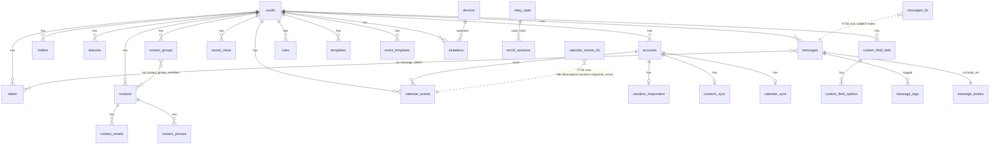

# Database Reference

Canonical reference for the **30 tables + 2 FTS5 virtual tables** in the local SQLite vault, generated by reading `src-tauri/src/db/schema.rs` directly.

The vault uses `rusqlite` with the `bundled-sqlcipher` feature — every byte at rest is XChaCha20-encrypted by SQLCipher with a key derived from the user's vault key. The relay server's database (`relay-server/`) uses **plain SQLite** (no encryption) because the relay only stores opaque encrypted blobs, so disk encryption would be redundant. Do not mix these.

Last verified against `src-tauri/src/db/schema.rs`: 2026-05-28.

---

## Entity-relationship diagram (mermaid)



---

## Tables grouped by domain

### Vault root

| Table | Purpose | Key columns |
|---|---|---|
| `vaults` | One row per vault (a vault is typically the user's local data directory). | `id` (PK), `path`, `created_at` |

### Account / connection state

| Table | Purpose | Notes |
|---|---|---|
| `accounts` | Email accounts (Gmail/IMAP/Outlook). Tokens stored encrypted at rest by SQLCipher. | `provider ∈ {gmail, jmap, imap}`. Cursor columns: `history_id` (Gmail), `sync_cursor` (added in EP-6 for IMAP/Outlook). Per-account `signature_html`, `preferences_json`, `photo_url`. |
| `devices` | Devices enrolled in the relay sync. | `device_id` is stamped on every mutation. |
| `relay_state` | Per-relay-URL cursor + last sync timestamp. | `hosting_port` non-NULL when this device runs the embedded relay. |
| `enroll_sessions` | 6-digit pairing codes for new device enrollment. 10-minute TTL. | `code_hash` is BLAKE3(code), not the code itself. `encrypted_vault_key` is wrapped with a key derived from the code. |
| `vault_key` | Wraps the per-vault XChaCha20 key. | One row per vault. |

### Message structure

| Table | Purpose |
|---|---|
| `folders` | Hierarchical mail folders (system + user). `disk_slug` is the on-disk directory name used in local-first mode. |
| `labels` | Provider-aligned labels (Gmail labels, IMAP keywords). `provider_id` links to upstream. |
| `statuses` | User-defined workflow statuses for kanban. `is_default` / `is_terminal` flag the bookends. |
| `custom_field_defs` | User-defined custom fields. `type ∈ {text, number, date, select, multi_select}`. |
| `custom_field_options` | Options for `select` / `multi_select` custom fields. FK cascades on field delete. |
| `messages` | The main message table. Indexed for inbox load, time queries, thread grouping, unread filter, kanban, Gmail dedup, account-scoped bulk delete. JSON columns for from/to/cc/bcc/attachments/custom_fields. |
| `message_labels` | Many-to-many between messages and labels. Composite PK. |
| `message_tags` | Many-to-many between messages and user tags. |
| `tag_usage` | Per-vault tag frequency / recency (for autocomplete). |
| `message_bodies` | Sanitised HTML body keyed by `body_ref` (so swapped between memory hot path and lazy load). |

### Sync log

| Table | Purpose |
|---|---|
| `mutations` | **Append-only mutation log.** Single source of truth for cross-device sync. `kind` + `payload_json` represent the user intent (one of 70 `MutationKind`s). `synced_at` = NULL means pending Gmail outbound. `relay_seq` = NULL means pending relay outbound. `device_id` + `lamport` give causal order for cross-device merge. |

### Contacts (EP-3 + EP-9)

| Table | Purpose |
|---|---|
| `contacts` | Contact record (name + company + title + website + location + notes + tags). EP-9 added `birthday`, `social_json`, `addresses_json`, `source`, `external_id`, `importance`. |
| `contact_emails` | Multi-email per contact (composite PK on `contact_id + email`). |
| `contact_phones` | Multi-phone per contact with optional label. |
| `contact_groups` | User-defined contact groups (color + position). |
| `contact_group_members` | Many-to-many between groups and contacts. |
| `contacts_sync` | Per-account Google People API sync token + last-synced timestamp. |

### Calendar (EP-10 / EP-11 / EP-12 / EP-13)

| Table | Purpose |
|---|---|
| `calendar_events` | Calendar event. Multi-calendar via `calendar_id`. EP-10/11/12 columns: `html_link`, `notes` (local), `source_message_id` (Compose→Event), `conference_url`, `color_id`, `ical_uid`, `recurring_event_id`, `creator_email`, `visibility`, `transparency`, `reminders_json`, `attachments_json`. Indexes on vault and `(vault_id, start_ts, end_ts)`. |
| `calendar_sync` | Per-account Google Calendar sync token + last-synced timestamp. |
| `event_templates` (EP-13) | Reusable event templates with duration + default attendees. |

### Rules + Templates (EP-7)

| Table | Purpose |
|---|---|
| `rules` | Automation rules. `conditions_json` + `condition_logic` (`AND`/`OR`) + `actions_json`. `position` for ordering — **but reordering has no handler today** (see `docs/known-gaps.md` item 1). |
| `templates` | Email templates (subject + body_html). |

### Settings / personal

| Table | Purpose |
|---|---|
| `vacation_responders` (EP-7 stage 4) | Per-account vacation auto-responder. Mirrored to Gmail's vacation API for Gmail accounts. |
| `saved_views` (EP-1) | Saved filter+grouping configurations. |

### Full-text search

| Virtual table | Purpose | Source |
|---|---|---|
| `messages_fts` | FTS5 over `subject` + `notes`. `content='messages'`, `content_rowid='rowid'`. Kept in sync via three triggers on `messages` (AI/BD/AU). | EP-7 |
| `calendar_events_fts` | FTS5 over `title` + `description` + `location` + `organizer_email`. | EP-11 |

---

## Index inventory

All indexes are defined in `schema.rs`:

| Index | On | Purpose |
|---|---|---|
| `idx_folders_vault` | `folders(vault_id)` | Vault-scoped folder list |
| `idx_labels_vault` | `labels(vault_id)` | Vault-scoped label list |
| `idx_messages_vault_folder_time` | `messages(vault_id, folder_id, received_at DESC)` | Primary inbox load |
| `idx_messages_vault_time` | `messages(vault_id, received_at DESC)` | Cross-folder time-sorted listing |
| `idx_messages_vault_thread` | `messages(vault_id, thread_id)` | Thread grouping |
| `idx_messages_unread` | `messages(vault_id, received_at DESC) WHERE flags_read = 0` | **Partial index** for unread badge counts |
| `idx_messages_vault_status` | `messages(vault_id, status_id)` | Kanban / status views |
| `idx_messages_provider` | `messages(provider_account_id, provider_id)` | Gmail upsert dedup (hot path) |
| `idx_messages_account` | `messages(vault_id, provider_account_id)` | `disconnect_account` bulk delete |
| `idx_ml_label` | `message_labels(label_id)` | Reverse lookup |
| `idx_mt_tag` | `message_tags(tag)` | Reverse lookup |
| `idx_mutations_pending` | `mutations(synced_at) WHERE synced_at IS NULL` | **Partial index** for outbound queue |
| `idx_mutations_relay` | `mutations(relay_seq) WHERE relay_seq IS NULL` | **Partial index** for relay queue |
| `idx_contacts_vault` | `contacts(vault_id)` | |
| `idx_contact_emails_email` | `contact_emails(email)` | Sender → contact lookup |
| `idx_contact_groups_vault` | `contact_groups(vault_id)` | |
| `idx_calendar_events_vault` | `calendar_events(vault_id)` | |
| `idx_calendar_events_range` | `calendar_events(vault_id, start_ts, end_ts)` | Day/week/month range queries |
| `idx_saved_views_vault` | `saved_views(vault_id)` | |
| `idx_rules_vault` | `rules(vault_id, enabled)` | Active-rules filter |
| `idx_templates_vault` | `templates(vault_id)` | |
| `idx_event_templates_vault` | `event_templates(vault_id)` | |
| `idx_vacation_responders_account` | `vacation_responders(account_id)` | |

---

## Migration model

Migrations are not file-per-version. They are constants in `schema.rs`, executed at vault open in this order by `db/mod.rs`:

1. `SCHEMA_SQL` — baseline DDL, idempotent (`IF NOT EXISTS`).
2. `EP6_ALTER_SQL[]` — per-statement `ALTER TABLE ADD COLUMN`; "duplicate column" errors are ignored.
3. `EP6_IDEMPOTENT_SQL` — rules + templates tables + FTS5 sync triggers.
4. `EP7_ALTER_SQL[]` — `signature_html`, `preferences_json` on accounts.
5. `EP7_STAGE4_SQL` — `vacation_responders` table.
6. `EP8_ALTER_SQL[]` — `photo_url` on accounts/contacts + `always_show_images` on contacts.
7. `EP9_ALTER_SQL[]` — CRM columns on contacts.
8. `EP9_IDEMPOTENT_SQL` — `contact_groups`, `contact_group_members`, `contacts_sync`, `calendar_events`, `calendar_sync`.
9. `EP10_ALTER_SQL[]` — `html_link` on events, `ical_data` on messages.
10. `EP11_ALTER_SQL[]` — `notes`, `source_message_id` on events.
11. `EP11_IDEMPOTENT_SQL` — `calendar_events_fts`.
12. `EP12_ALTER_SQL[]` — 9 new columns capturing remaining Google Calendar API fields.
13. `EP13_IDEMPOTENT_SQL` — `event_templates`.

**Pattern for adding a new column:** add a new `EP<N>_ALTER_SQL` constant with the `ALTER TABLE` statement, and append the constant's execution to `db/mod.rs`. Per-statement execution so "duplicate column" errors on previously-applied migrations are swallowed.

**Pattern for adding a new table:** add to `EP<N>_IDEMPOTENT_SQL` (or extend `SCHEMA_SQL` if it's first-pass).

---

## Mutation → table cross-reference

Which `MutationKind` writes to which tables (helpful when adding new mutations):

| MutationKind family | Tables touched |
|---|---|
| `*_FOLDER` (5 kinds) | `folders` (+ `messages.folder_id` for moves; in local-first mode also FS rename via `apply_local_first_fs`) |
| `*_LABEL` (7 kinds) | `labels`, `message_labels` |
| `*_TAG*` (4 kinds) | `message_tags`, `tag_usage` |
| `*_STATUS*` (6 kinds) | `statuses`, `messages.status_id` |
| `SET_PRIORITY`, `CLEAR_PRIORITY`, `SET_STAR`, `CLEAR_STAR`, `SET_PINNED`, `SET_MUTED`, `SET_NOTE` | `messages` (single column writes) |
| `SET_FLAG`, `UPDATE_FLAG`, `COMPLETE_FLAG`, `CLEAR_FLAG` | `messages.flag_json` |
| `CREATE_CUSTOM_FIELD`, `UPDATE_CUSTOM_FIELD`, `DELETE_CUSTOM_FIELD` | `custom_field_defs`, `custom_field_options` |
| `SET_CUSTOM_FIELD_VALUE`, `CLEAR_CUSTOM_FIELD_VALUE` | `messages.custom_fields_json` |
| `READ`, `UNREAD`, `ARCHIVE`, `TRASH`, `SNOOZE`, `DELETE_MESSAGE` | `messages.flags_*`, `messages.folder_id` |
| `SEND_MESSAGE`, `RECEIVE_FROM_PROVIDER` | `messages` (inserts) |
| `SAVE_VIEW`, `DELETE_VIEW`, `RENAME_VIEW` | `saved_views` |
| `UPSERT_CONTACT`, `UPDATE_CONTACT`, `DELETE_CONTACT` | `contacts`, `contact_emails`, `contact_phones` |
| `CREATE_CONTACT_GROUP`, `UPDATE_CONTACT_GROUP`, `DELETE_CONTACT_GROUP`, `ADD_CONTACT_TO_GROUP`, `REMOVE_CONTACT_FROM_GROUP` | `contact_groups`, `contact_group_members` |
| `CREATE_RULE`, `UPDATE_RULE`, `DELETE_RULE` | `rules` |
| `REORDER_RULES` | **Nothing today — no handler.** See `docs/known-gaps.md` item 1. |
| `CREATE_TEMPLATE`, `UPDATE_TEMPLATE`, `DELETE_TEMPLATE` | `templates` |
| `UPSERT_CALENDAR_EVENT`, `UPDATE_CALENDAR_EVENT`, `UPDATE_CALENDAR_EVENT_NOTES`, `DELETE_CALENDAR_EVENT` | `calendar_events` |
| `SAVE_EVENT_TEMPLATE`, `DELETE_EVENT_TEMPLATE` | `event_templates` |
| (every mutation) | `mutations` (append; `relay_seq` set to NULL until drained) |

---

## How to inspect a vault on disk

```bash
# Open vault with sqlite3 (must have sqlcipher; use sqlcipher CLI instead of plain sqlite3)
sqlcipher /path/to/vault.db
sqlite> PRAGMA key = "x'<hex-key-from-get_vault_key_hex>'";
sqlite> .tables
sqlite> SELECT id, kind, ts, synced_at, relay_seq FROM mutations ORDER BY ts DESC LIMIT 20;
```

Vault key is retrievable from the running app via the `get_vault_key_hex` IPC (used by the relay enrollment and backup flows).
