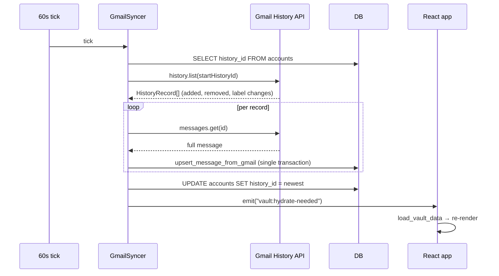
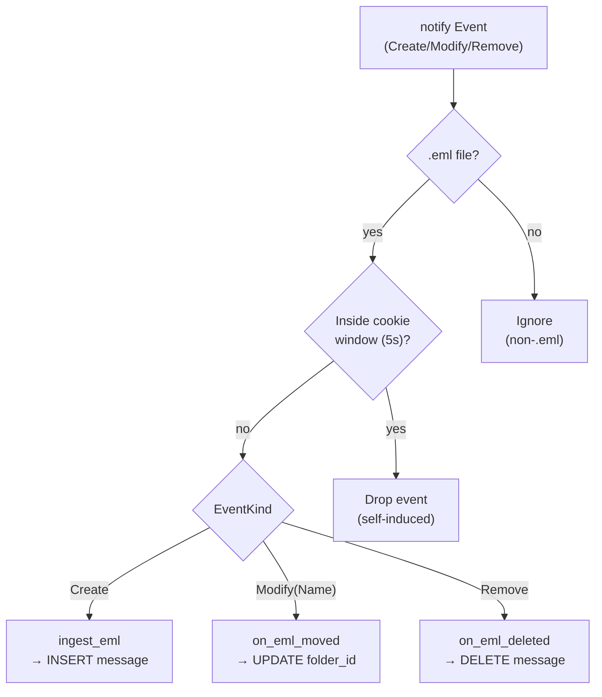

# Nexus — Developer Guide

Practical how-to reference for engineers working on Nexus. This document covers day-to-day tasks: setting up the environment, extending the mutation system, adding IPC commands, working with the database, and building for production.

For **why the system is designed the way it is**, see [architecture.md](architecture.md).
For **canonical terminology** (LBL, MSG, MUTN…), see [glossary.md](glossary.md).
For **design tokens and component patterns**, see [UI-DESIGN-SYSTEM-SPEC.md](UI-DESIGN-SYSTEM-SPEC.md).

---

## Prerequisites

| Tool | Minimum version | Install |
|------|----------------|---------|
| macOS | 13 Ventura | — |
| Node.js | 20 | [nodejs.org](https://nodejs.org) or `brew install node` |
| pnpm | 8 | `npm install -g pnpm` |
| Rust | 1.77 | `curl --proto '=https' --tlsv1.2 -sSf https://sh.rustup.rs \| sh` |
| Xcode Command Line Tools | latest | `xcode-select --install` |

---

## First-Time Setup

```bash
# 1. Clone
git clone https://github.com/wdsmcguigan/nexus-v2.git
cd nexus-v2

# 2. Install Node dependencies (uses pnpm workspace)
pnpm install

# 3. Configure Gmail credentials
cp .env.example .env
# Edit .env — fill in NEXUS_GMAIL_CLIENT_ID and NEXUS_GMAIL_CLIENT_SECRET
# See "Gmail OAuth setup" below

# 4. Start the full desktop app
pnpm tauri:dev
```

On first launch, Nexus shows the vault setup screen (choose a folder → creates `nexus.db` there). Then connect a Gmail account.

### Gmail OAuth Setup

1. Go to [console.cloud.google.com](https://console.cloud.google.com) → New project
2. APIs & Services → Enable API → search "Gmail API" → Enable
3. APIs & Services → Credentials → Create credentials → OAuth client ID → Desktop app
4. In "Authorized redirect URIs", add: `http://localhost`
5. Download the credentials JSON; copy `client_id` and `client_secret` to `.env`

The OAuth flow opens a browser window. After authorization, the token is stored in the macOS Keychain via the `keyring` crate.

---

## Project Layout

```
nexus-v2/
├── src/                            # React + TypeScript frontend
│   ├── App.tsx                     # Root component (vault check → workspace)
│   ├── data/
│   │   └── types.ts                # ALL canonical types and the MutationKind enum
│   ├── state/
│   │   ├── mutations.ts            # recordMutation() — the single write path
│   │   └── workspace.ts            # Zustand store for UI state
│   ├── storage/
│   │   ├── tauri.ts                # Typed wrappers for all Tauri IPC commands
│   │   └── useStore.ts             # React hooks over the in-memory store
│   └── components/
│       ├── chrome/                 # App frame: WorkspaceChrome, StatusBar
│       ├── email/                  # EmailListPanel, EmailViewerPanel, EmailComposerPanel
│       ├── inspector/              # InspectorPanel and all metadata pickers
│       ├── nav/                    # NavigationPanel (folder/label/status tree)
│       ├── filter/                 # FilterBar (query pill UI)
│       ├── palette/                # CommandPalette (⌘K)
│       ├── calendar/               # CalendarPanel, AgendaView, WeekView, MonthView, MiniMonth, EventDetailPopover, EventCreateModal, EventEditModal, CalendarManagementSection
│       ├── contacts/               # ContactsPanel, ContactCard, ContactHoverCard
│       ├── settings/               # SettingsPanel, CustomFieldsSettings, EventTemplatesSettings
│       ├── views/                  # TableView, KanbanView
│       ├── onboarding/             # VaultSetup, GmailConnect
│       ├── panel/                  # Panel, PanelHeader, PanelEmpty (dockview wrappers)
│       └── ui/                     # Button, Input, Avatar, Tooltip, ColorPicker…
├── src-tauri/
│   ├── Cargo.toml                  # Rust deps (note: tao patch for macOS 15)
│   └── src/
│       ├── lib.rs                  # AppState, plugin init, invoke_handler! registration
│       ├── commands.rs             # IPC command implementations
│       ├── crypto.rs               # XChaCha20-Poly1305, BLAKE3, enrollment code gen
│       ├── db/
│       │   ├── schema.rs           # SQLite DDL constants
│       │   ├── queries.rs          # All DB read/write helpers
│       │   └── mod.rs              # VaultDb struct, open(), migration runner
│       ├── gmail/                  # OAuth, History API sync, outbound mutations
│       ├── relay/                  # E2EE relay client + embedded server
│       └── watcher/                # Background sync watcher
├── relay-server/                   # Standalone nexus-relay binary
│   ├── Cargo.toml
│   └── src/
│       ├── main.rs                 # Entry: RELAY_DB_PATH, RELAY_PORT, RELAY_HOST
│       ├── db.rs                   # Relay SQLite schema + queries
│       └── routes.rs               # axum route handlers
└── docs/                           # All documentation
```

---

## Development Commands

```bash
pnpm dev              # Vite only — frontend at http://localhost:1420, no Tauri IPC
pnpm tauri:dev        # Full app — Vite + Rust in watch mode (requires .env)
pnpm typecheck        # TypeScript type check (must pass before committing)
pnpm lint             # ESLint zero-warnings (must pass before committing)
pnpm test             # Vitest unit tests
pnpm test:watch       # Vitest watch mode
pnpm build            # Frontend production build
pnpm tauri:build      # Full .app bundle

cargo check -p nexus           # Rust backend type + compile check
cargo check -p nexus-relay     # Standalone relay binary check
cargo test -p nexus            # Rust unit tests
```

---

## How to Add a New Mutation Kind

Every user-initiated data change flows through the mutation system. Here's how to add a new kind end-to-end:

### Step 1 — Add the kind to the enum

In `src/data/types.ts`, find the `MutationKind` enum (currently 70 entries) and add your new kind:

```ts
export type MutationKind =
  | "ADD_LABEL"
  | "REMOVE_LABEL"
  // ... existing kinds ...
  | "MY_NEW_ACTION";   // ← add here
```

If your mutation needs a typed payload beyond `{ messageId: string }`, add an interface:

```ts
export interface MyNewActionPayload {
  messageId: string;
  someField: string;
}
```

### Step 2 — Add a helper function

In `src/state/mutations.ts`, add a typed helper that calls `recordMutation`:

```ts
export function myNewAction(messageId: string, someField: string) {
  recordMutation("MY_NEW_ACTION", { messageId, someField } satisfies MyNewActionPayload);
}
```

Call this helper from React components — never call `recordMutation` directly from UI code.

### Step 3 — Apply it in the Rust DB layer

In `src-tauri/src/db/queries.rs`, find `apply_mutation_to_tables()` and add a branch for your new kind:

```rust
"MY_NEW_ACTION" => {
    let message_id = payload["messageId"].as_str().unwrap_or("");
    let some_field = payload["someField"].as_str().unwrap_or("");
    self.conn.execute(
        "UPDATE messages SET some_column = ?1 WHERE id = ?2",
        rusqlite::params![some_field, message_id],
    )?;
}
```

**Gotcha:** The `queries.rs` file has a local `OptionalExt` blanket impl for `.optional()`. Do NOT add `use rusqlite::OptionalExtension;` — this causes E0034 (ambiguous method call). The local trait handles it.

### Step 4 — Write a test

In `src/state/__tests__/mutations.test.ts`:

```ts
it("MY_NEW_ACTION sets someField", () => {
  const { mutations } = applyMutation(
    initialState,
    { kind: "MY_NEW_ACTION", payload: { messageId: "msg-1", someField: "hello" } }
  );
  expect(mutations.at(-1)?.kind).toBe("MY_NEW_ACTION");
  // assert the expected state change
});
```

Run with `pnpm test`.

---

## How to Add a New IPC Command

### Step 1 — Implement the Rust command

In `src-tauri/src/commands.rs`:

```rust
#[tauri::command]
pub async fn my_command(
    state: tauri::State<'_, crate::AppState>,
    some_param: String,
) -> Result<String, String> {
    let db_guard = state.db.lock().map_err(|e| e.to_string())?;
    let db = db_guard.as_ref().ok_or("vault not loaded")?;
    // ... implementation ...
    Ok("result".to_string())
}
```

**Async + VaultDb:** `VaultDb` wraps `rusqlite::Connection` which is not `Send`. If your command has `.await` points, don't hold a `&VaultDb` across them. Instead, grab what you need before the first await, or pass `db_path: String` and open a fresh `VaultDb::open()` after the await points.

### Step 2 — Register the command

In `src-tauri/src/lib.rs`, add to the `invoke_handler!` list:

```rust
.invoke_handler(tauri::generate_handler![
    // ... existing commands ...
    commands::my_command,
])
```

### Step 3 — Add a typed frontend wrapper

In `src/storage/tauri.ts`:

```ts
export async function myCommand(someParam: string): Promise<string> {
  return invoke<string>("my_command", { someParam });
}
```

Import and call `myCommand()` from React components.

---

## How to Add a New Settings Section

`src/components/settings/SettingsPanel.tsx` uses a `activeSection` state and a nav item list. To add a new section:

1. Add your section ID to the union type:
   ```ts
   const [activeSection, setActiveSection] =
     React.useState<"accounts" | "preferences" | "fields" | "relay" | "my-section">("accounts");
   ```

2. Add a nav item:
   ```ts
   { id: "my-section" as const, label: "My Section", icon: <MyIcon size={14} /> },
   ```

3. Add the content branch in the right panel:
   ```tsx
   {activeSection === "my-section" && <MySection />}
   ```

4. Create a `MySection` component in the same file (or import it from a new file in `components/settings/`).

---

## Database Schema

The vault database lives at `{vault_path}/.nexus/db.sqlite` and is encrypted with SQLCipher. See `src-tauri/src/db/schema.rs` for the full DDL.

### Core tables

| Table | Purpose |
|-------|---------|
| `vaults` | Vault ID, path, creation timestamp |
| `accounts` | Provider auth (tokens stored in Keychain), sync cursor; `signature_html TEXT` and `preferences_json TEXT` columns hold per-account signature and reply/image preferences |
| `folders` | Tree structure, disk slugs, system folder kinds |
| `labels` | Many-to-many labels (system + user-defined) |
| `statuses` | Workflow status definitions (ordered, isDefault/isTerminal) |
| `custom_field_defs` | Custom field type definitions |
| `custom_field_options` | Color-coded options for select/multi-select fields |
| `messages` | Full envelope: subject, body_ref, from/to/cc/bcc JSON, attachments |
| `message_labels` | Many-to-many message ↔ label |
| `message_tags` | Many-to-many message ↔ tag (free-form strings) |
| `tag_usage` | Denormalized tag count + lastUsedAt (for autocomplete) |
| `message_bodies` | HTML body cache by body_ref |
| `mutations` | Write-ahead log: kind, payload_json, device_id, lamport, relay_seq |
| `rules` | Automation rules: conditions JSON, actions JSON, enabled, position |
| `templates` | Email templates: name, subject, bodyHtml |
| `messages_fts` | FTS5 virtual table (subject + notes full-text search) |
| `contacts` | Contact records |
| `contact_emails` / `contact_phones` | Contact email/phone lists |
| `vault_key` | 32-byte XChaCha20 vault key (hex) |
| `devices` | Enrolled devices (device_id, nickname, enrolled_at) |
| `relay_state` | Relay URL, last pulled sequence number |
| `enroll_sessions` | Active enrollment sessions (code hash, encrypted vault key) |
| `vacation_responders` | Per-account auto-reply config: subject, body_html, date range, contacts_only, sent_to dedup list |
| `calendars` | Connected Google Calendars: externalId, name, color, enabled toggle (EP-11) |
| `calendar_events` | Calendar event instances with 9 extra columns from EP-12 (conference_url, color_id, ical_uid, recurring_event_id, creator_email, visibility, transparency, reminders_json, attachments_json) |
| `event_templates` | Reusable event presets: name, title, description, location, duration_minutes, default_attendees_json (EP-13) |

### Column migrations

Because the vault DB is created by existing installs, new columns are added via `ALTER TABLE` migrations in `VaultDb::run_column_migrations()` (in `src-tauri/src/db/mod.rs`). These run on every `VaultDb::open()` and ignore errors (so duplicate column adds are safe). New columns must have defaults.

When adding a new column to an existing table:
1. Add it to the `CREATE TABLE` DDL in `schema.rs` (for fresh installs)
2. Add a migration in `run_column_migrations()` in `mod.rs`:
   ```rust
   "ALTER TABLE my_table ADD COLUMN my_col TEXT NOT NULL DEFAULT ''",
   ```

For **new tables** (rather than new columns), add them to a separate EP constant (e.g., `EP7_STAGE4_SQL`) using `CREATE TABLE IF NOT EXISTS`, then call it from the appropriate migration runner (e.g., `run_ep7_migrations()`). This pattern is idempotent and safe to call on every open.

### WorkspaceSnapshot (localStorage: `nexus_workspaces_v3`)

The `WorkspaceSnapshot` interface in `src/storage/workspaceManager.ts` persists per-workspace UI state. Fields added across epics:

| Field | Type | Default | Purpose |
|-------|------|---------|---------|
| `density` | `"compact" \| "comfortable" \| "cozy"` | `"comfortable"` | Row height / spacing |
| `viewMode` | `"list" \| "kanban" \| "table"` | `"list"` | Active view |
| `theme` | `"dark" \| "light"` | `"dark"` | Color theme |
| `threadedView` | `boolean` | `true` | Group messages by thread |
| `showSnippets` | `boolean` | `true` | Show body preview in list rows |
| `activeStars` | `StarStyle[]` | `[]` | Active star styles (empty = all 12 cycle) |
| `keyBindings` | `Partial<Record<ShortcutAction, string>>` | `{}` | Custom key overrides (empty = use defaults) |
| `filteredViewBehavior` | `"replace" \| "new-panel"` | `"replace"` | Jump-to-filtered opening mode |
| `tableColumnOrder` | `string[]` | `[]` | Table column order (empty = default) |
| `tableColumnWidths` | `Record<string, number>` | `{}` | Per-column width overrides |
| `activeFilter` | `MetadataFilter` | `{}` | Current filter state |
| `selectedFolderId` | `string` | `"inbox"` | Active folder |

### App-Global Preferences (localStorage: `nexus_app_prefs_v1`)

Settings that should not differ per workspace are stored in `src/lib/appPreferences.ts`:

```ts
export interface AppPreferences {
  notificationsEnabled: boolean;            // default: true
  undoSendSeconds: 0 | 5 | 10 | 20 | 30;  // default: 5
  markReadAfterMs: -1 | 0 | 1000 | 3000 | 10000; // -1 = never; default: 3000
  buttonLabels: "icons" | "text";           // default: "icons"
}
```

Use `getAppPreferences()` to read and `saveAppPreferences(partial)` to write. No Zustand — these are read synchronously at component render time.

### Keyboard Shortcut Registry (`src/lib/shortcuts.ts`)

All rebindable shortcuts are defined here:

```ts
export type ShortcutAction = "reply" | "forward" | "archive" | "delete" | ...;
export const DEFAULT_SHORTCUTS: ShortcutDef[];
export function effectiveKey(action: ShortcutAction, keyBindings: Partial<Record<ShortcutAction, string>>): string;
export function actionForKey(key: string, keyBindings: ...): ShortcutAction | null;
```

`actionForKey` checks custom bindings first, then falls back to defaults. The keyboard handler in `EmailListPanel.tsx` calls this on every `keydown` event.

### FTS5 search

The `messages_fts` virtual table indexes `subject`, `notes`, `from_addr`, `to_addrs`, and tag/label names. It's updated by INSERT/UPDATE/DELETE triggers in `schema.rs`. A backfill migration populates it on first open.

The `search_messages` IPC command routes to native FTS5 in Tauri mode and falls back to MiniSearch in web/dev mode. Use `src/storage/fts.ts` — do not call the IPC directly.

**Field-prefix operators** (native FTS5 only):
- `from:alice` — messages from addresses containing "alice"
- `to:bob` — messages to addresses containing "bob"
- `tag:urgent` — messages with tag containing "urgent"
- `label:work` — messages with label containing "work"
- `has:attachment` — messages with attachments

```rust
// Native FTS5 query (commands.rs)
self.conn.prepare(
    "SELECT m.id FROM messages_fts fts JOIN messages m ON m.id = fts.rowid
     WHERE fts MATCH ?1 LIMIT ?2"
)?.query_map([query, limit], ...)?
```

---

## Testing

### Frontend

```bash
pnpm test           # single run
pnpm test:watch     # watch mode
```

Test files live alongside the code in `__tests__/` subdirectories:

- `src/storage/__tests__/` — store indexes, queries, saved views, FTS (EP-3)
- `src/state/__tests__/` — mutation round-trips

### Rust

```bash
cargo test -p nexus
```

Rust test coverage is currently limited. Unit tests for pure functions (crypto, hex encoding) can be added directly in the source file using `#[cfg(test)] mod tests { ... }`.

---

## Linting and Type Checking

Both must pass before committing:

```bash
pnpm typecheck   # zero TypeScript errors
pnpm lint        # zero ESLint warnings or errors
```

The TypeScript config (`tsconfig.app.json`) enables strict mode plus `noUnusedLocals` and `noUnusedParameters`. Rust uses `cargo check` for compile-time verification; clippy is not yet required but recommended.

---

## Building for Production

```bash
pnpm tauri:build
```

Output is at `src-tauri/target/release/bundle/`:
- `macos/Nexus.app` — macOS application bundle
- `macos/Nexus_x.y.z_aarch64.dmg` — installer disk image (Apple Silicon)
- `macos/Nexus_x.y.z_x64.dmg` — installer disk image (Intel)

The relay binary builds separately:

```bash
cargo build -p nexus-relay --release
# → relay-server/target/release/nexus-relay
```

---

## Multi-Provider Support (EP-6+)

> **Status check before reading:** EP-6 is shipped partial. Provider-by-provider current state:
>
> | Provider | Status |
> |---|---|
> | Gmail | ✅ Full (OAuth + History API + calendar + contacts) |
> | IMAP | ✅ Sync + SMTP send + autodiscovery |
> | Outlook | ✅ OAuth → IMAP plumbing underneath |
> | IMAP IDLE | ✅ Real IDLE via `async-imap` `Session::idle()` (RFC 2177, 28-minute re-arm); 30s NOOP/EXAMINE fallback for non-IDLE servers |
> | JMAP | ✅ RFC 8620/8621 implementation with bearer-token auth (OAuth2 + PKCE is a follow-up — `docs/known-gaps.md` item 29) |
>
> See `docs/epic-6-checklist.md`.

### IMAP autodiscovery

```ts
// 1. Discover IMAP/SMTP settings from the domain
const discovery = await discoverImapSettings("user@example.com");
// → { imapHost, imapPort, imapSecurity, smtpHost, smtpPort, smtpSecurity }

// 2. Test credentials
const ok = await testImapConnection({ host, port, security, username, password });

// 3. Add the account
const { accountId, email } = await addImapAccount({ email, imapHost, imapPort, ... });
```

All three functions are in `src/storage/tauri.ts`. The Rust implementations live in `src-tauri/src/commands.rs`.

### Outlook OAuth

```ts
// Opens browser for Microsoft OAuth; returns { accountId, email }
const result = await startOutlookOAuth();
```

After OAuth completes, the account uses the IMAP/SMTP sync path with tokens stored in the macOS Keychain.

### Sync workers

Every provider account syncs via `sync_account_now(accountId)`. The Rust side dispatches by `provider_type` in the `accounts` table:
- `"gmail"` → `GmailSyncer` (History API)
- `"imap"` / `"outlook"` → `ImapProvider` (sync) + `imap_idle::start_idle_watcher` (push)
- `"jmap"` → `JmapProvider` (RFC 8620/8621; uses `Email/changes` + `Mailbox/changes` for incremental)

Background Gmail polling runs every 60s and reads `client_mode` fresh on each tick via `read_client_mode(vault_path)`. For IMAP, real-time push is handled by `providers/imap_idle.rs`: `start_idle_watcher` opens a long-lived connection, uses `async-imap` `Session::idle()` with a 28-minute re-arm (RFC 2177), and emits `vault:hydrate-needed` on every server-pushed change. Servers without the `IDLE` capability fall back to a 30-second NOOP/EXAMINE poll on the same connection. The watcher is spawned in `add_imap_account` after the first sync and re-spawned at vault init for every existing IMAP account via `start_imap_watchers_for_existing_accounts`.

### Inbound provider sync (Gmail incremental example)



---

## Local-First Mode (EP-6+)

When `client_mode == "local-first"`, mutations trigger filesystem side-effects **in addition to** DB writes.

### App → disk (`apply_local_first_fs` in `commands.rs`)

Called at the end of `apply_mutation` for every mutation when in local-first mode:

| Mutation | FS side-effect |
|---|---|
| `CREATE_FOLDER` | `fs::create_dir_all(mail_root/diskPath)` |
| `RENAME_FOLDER` | `fs::rename(old_dir, new_dir)` + bulk `UPDATE messages SET eml_path` |
| `MOVE_TO_FOLDER` | `fs::rename(old_eml_path, new_folder/filename.eml)` + `UPDATE messages SET eml_path` |

EML files are written inside the DB transaction during sync via `write_eml_file()` in `src-tauri/src/gmail/sync.rs`.

### Disk → app (FS watcher → mutations)

The `notify` crate watcher (`src-tauri/src/watcher/`) emits `vault:hydrate-needed` events when files change. Expected changes (tagged by the app) are ignored to prevent loops.



Cookies are added to `CookieMap` by `apply_local_first_fs` whenever the app itself triggers a filesystem change. The watcher checks for an entry within a 5-second window before generating a mutation. Without this guard, every app-initiated rename would echo back as a disk-originated event and create a duplicate mutation.

### Client mode lifecycle

```rust
// Read from .nexus-mode file (used at startup + on every poll tick)
pub fn read_client_mode(vault_path: &str) -> String { ... }

// IPC: get current mode
pub async fn get_client_mode(state: State<AppState>) -> Result<String, String>

// IPC: set mode + persist to .nexus-mode + create mail/ dir if local-first
pub async fn set_client_mode(mode: String, state: State<AppState>) -> Result<(), String>
```

Frontend: `src/lib/clientMode.ts` provides `loadClientMode()` / `saveClientMode()` over `localStorage`. `VaultSetup.tsx` calls `setClientModeIpc()` on mode selection.

---

## Rules and Templates (EP-7+)

### Rules

Rules fire once when a message is inserted. The engine runs in `apply_rules_to_message()` in `src-tauri/src/db/queries.rs`, called by `upsert_message_from_gmail()` on every inbound message.

**IPC:**
```ts
const rules = await getRules(vaultId);
await saveRule(vaultId, rule);      // create or update
await deleteRule(ruleId, vaultId);
```

**Mutation helpers** (always use these — not the IPC directly):
```ts
saveRuleMutation(rule)       // in src/state/mutations.ts
deleteRuleMutation(ruleId)
```

**UI:** `RulesSettings.tsx` + `RuleEditorDialog.tsx` in `src/components/settings/`.

### Templates

**IPC:**
```ts
const templates = await getTemplates(vaultId);
await saveTemplate(vaultId, template);
await deleteTemplate(templateId, vaultId);
```

**Mutation helpers:**
```ts
saveTemplateMutation(template)
deleteTemplateMutation(templateId)
```

**UI:** `TemplatesSettings.tsx` in `src/components/settings/`. Composer toolbar "Insert template" button in `EmailComposerPanel.tsx`.

---

## Calendar (EP-11, EP-12, EP-13)

### IPC

```ts
// EP-11
const events = await getCalendarEvents(vaultId, startMs, endMs);
await createCalendarEvent(vaultId, accountId, calendarId, event);
await updateCalendarEvent({ accountId, externalId, startTs, endTs, allDay });
await deleteCalendarEvent(eventId, vaultId);
await syncGoogleCalendar(accountId);

// EP-13
const templates = await getEventTemplates(vaultId);
await saveEventTemplate(vaultId, template);
await deleteEventTemplate(templateId, vaultId);
```

**Important:** `updateCalendarEvent` takes `externalId` (the Google Calendar event ID), not the Nexus internal `id`. Using `id` silently fails to push the change to Google.

### Mutation helpers

```ts
// Always use these — not the IPC directly
saveEventTemplateMutation(template)     // src/state/mutations.ts
deleteEventTemplateMutation(templateId)
rescheduleCalendarEvent(store, eventId, newStartTs, newEndTs) // optimistic; call again with originals to roll back
```

### Event color

`src/lib/calendarColors.ts` exports `eventColor(colorId?: string): string`. Maps Google colorId "1"–"11" to their hex equivalents (Tomato, Flamingo, Tangerine, Banana, Sage, Basil, Peacock, Blueberry, Lavender, Grape, Graphite). Falls back to `var(--color-accent)` for missing/null values. Use this function everywhere an event needs a color — never hardcode hex values.

### WeekView overlap layout

`WeekView.tsx` uses a greedy two-pass column assignment via `layoutDayEvents()`:
- Pass 1: assign `col` index to each event (the first free column slot)
- Pass 2: compute `cols` (total concurrent column count) for each event to determine width

`HOUR_HEIGHT = 56` px. Total grid height = `HOUR_HEIGHT * 24` = 1344 px.

### EventCreateModal prefill

Any component can open the event creation modal pre-filled with data:
```ts
const openEventCreateModal = useWorkspace((s) => s.openEventCreateModal);
openEventCreateModal({ date?: string, attendees?: string[], title?: string });
```

The modal is mounted at `Workspace.tsx` root so it renders even when `CalendarPanel` is closed. The EmailComposerPanel uses this to create an event pre-filled with all current recipients.

### Drag-to-reschedule rollback

Both `WeekView` and `MonthView` do an optimistic local update first, then push to Google:
1. `rescheduleCalendarEvent(store, id, newStart, newEnd)` — updates local store immediately
2. `updateCalendarEvent({ accountId, externalId, startTs, endTs, allDay })` — pushes to Google
3. On IPC failure: `rescheduleCalendarEvent(store, id, origStart, origEnd)` — rolls back

Recurring events (`recurringEventId` set) have `draggable={false}` — rescheduling a recurring instance via simple timestamp-swap corrupts the series on Google's side.

---

## Contacts (EP-3 + inter-epic improvements)

### ContactHoverCard

`ContactHoverCard` wraps any element that should trigger a contact hover card on mouseenter:

```tsx
import { ContactHoverCard } from "@/components/contacts/ContactHoverCard";

<ContactHoverCard contact={contact}>
  <span>{contact.name}</span>
</ContactHoverCard>
```

`contact` is a `Contact | null` resolved by the caller (typically `localStore.contacts.get(id)` or found by email address). Returns `null` = hover card disabled (renders children as-is).

### useContactMessages hook

```ts
import { useContactMessages } from "@/storage/useStore";
const messages = useContactMessages(contactId, 5); // latest 5 messages from/to this contact
```

Returns messages where `fromAddr` or any `toAddrs` matches the contact's primary email, sorted by `receivedAt` descending.

### vCard import/export

```ts
import { parseVcf, serializeVcf } from "@/lib/vcard";

// Parse a .vcf file string → array of partial Contact objects
const contacts = parseVcf(vcfText);

// Serialize contacts → .vcf string for download/export
const vcfText = serializeVcf(selectedContacts);
```

Implements RFC 2426 vCard 3.0. Supported properties: FN, EMAIL, TEL, ORG, TITLE, URL, BDAY, ADR, NOTE, CATEGORIES, X-VIP. Line folding and property escaping are handled automatically.

---

## Known Gotchas

**Non-Send VaultDb across async:** `VaultDb` wraps `rusqlite::Connection` which contains `RefCell<LruCache>` — not `Send`. Never hold a `&VaultDb` across an `.await` point in a Tokio future. Pattern: pass `db_path: &str`, open a fresh connection inside the async fn after all awaits. See `src-tauri/src/relay/client.rs` for an example.

**OptionalExt conflict in queries.rs:** `src-tauri/src/db/queries.rs` defines a local `OptionalExt` blanket impl. Adding `use rusqlite::OptionalExtension;` anywhere in this file causes E0034 (ambiguous `.optional()` call). Do not add the import — the local trait handles all cases.

**macOS 15 / tao crash:** The `src-tauri/Cargo.toml` patches `tao` to fix a crash where Tauri accesses AppKit off the main thread on macOS 15. Do not remove this patch or upgrade `tao` without verifying the fix is upstreamed.

**SQLCipher vs plain SQLite:** The vault uses `rusqlite` with `bundled-sqlcipher`. The relay uses `rusqlite` with `bundled` (no encryption). Do not link these; they're separate binaries.

**Gmail OAuth redirect URI:** The OAuth flow opens a local HTTP listener on an ephemeral port. Google requires `http://localhost` (without a port number) in the authorized redirect URIs list, not `http://localhost:PORT`. A specific port will cause `redirect_uri_mismatch`.

**pnpm workspace:** Always run `pnpm install` from the repository root. The `relay-server/` crate has its own `Cargo.lock` and is a separate Cargo workspace.

**EmailViewerPanel / EmailBody:** Body rendering uses `contentDocument.write()` + `ResizeObserver` (not `srcDoc`/`onLoad`). The `bodyHtml` state is `string | null` — `null` = loading (show spinner), `""` = no body (show snippet), non-empty string = render in `EmailBody`. Do not revert to `srcDoc` — it breaks the image-blocking and auto-height logic.
