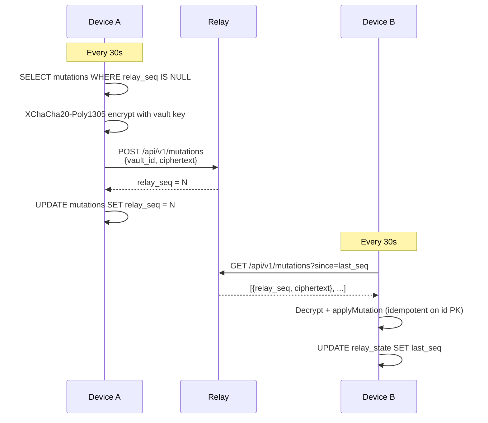

# Nexus Relay — Setup Guide

The Nexus relay is an optional, **self-hosted** sync server that lets you keep multiple devices (Mac, future iOS/Android) in sync. It is **zero-knowledge**: all mutations are encrypted on your device before they're sent, and the relay stores only opaque ciphertext. It can never read your email data.

---

## How It Works

When you make a change in Nexus (archive a message, add a label, change a status), that change is recorded as an encrypted mutation blob and queued locally. Every 30 seconds, Nexus pushes queued blobs to the relay and polls for blobs from other devices. Your other devices decrypt those blobs and apply the changes locally.

The relay never sees the vault key. It's a dumb forwarder of encrypted bytes.



> **Important**: the diagram is what's actually shipped. For the deep cryptographic threat model, see `docs/security-model.md`.

---

## Setup Options

### Option 1 — Host on This Mac (Simplest)

Best for: syncing between two instances on the same Mac, or two machines on the same home network.

1. Open **Settings → Relay** in Nexus
2. Click **"Host relay on this device"**
3. Nexus starts the relay inside the app on port 3030
4. Other devices on the same network can reach it at `http://your-mac-ip:3030`

Find your Mac's local IP in **System Settings → Network** or by running `ipconfig getifaddr en0` in Terminal.

**Limitation:** This only works while Nexus is open. If you close Nexus, the relay stops. Use the standalone binary (options 2 or 3) for always-on sync.

---

### Option 2 — Tailscale (Recommended for Personal Use)

Best for: syncing across networks (home + office, Mac + mobile) without port forwarding or a public server.

[Tailscale](https://tailscale.com) creates a private WireGuard network between your devices. Once installed, each device gets a stable private IP that's reachable from any network.

**Step-by-step:**

1. Install Tailscale on all devices that need to sync, plus the machine that will run the relay
2. Log into the same Tailscale account on all devices
3. Download the `nexus-relay` binary (see [Building from source](#building-from-source) or the GitHub releases page)
4. On the relay machine, run:
   ```bash
   RELAY_PORT=3030 RELAY_DB_PATH=~/nexus-relay.db ./nexus-relay
   ```
5. In Nexus on each device, go to **Settings → Relay**, paste the relay's Tailscale IP:
   ```
   http://100.x.y.z:3030
   ```
   (Find this in the Tailscale app or at [login.tailscale.com/admin/machines](https://login.tailscale.com/admin/machines))
6. Click **Save**

Tailscale handles NAT traversal, encryption in transit, and authentication — no firewall rules needed.

---

### Option 3 — VPS or Home Server

Best for: always-on sync accessible from anywhere, or if you want the relay reachable on the public internet.

1. Provision a small VPS (any provider) or use an always-on home server
2. Download the `nexus-relay` binary or build from source
3. Open the relay port in your firewall (default 3030, or any port you choose)
4. Run the relay:
   ```bash
   RELAY_PORT=3030 RELAY_DB_PATH=/var/lib/nexus-relay/relay.db ./nexus-relay
   ```
5. *(Optional)* Put nginx or Caddy in front for HTTPS:
   ```nginx
   server {
       listen 443 ssl;
       server_name relay.example.com;
       location / {
           proxy_pass http://127.0.0.1:3030;
       }
   }
   ```
6. In Nexus, set the relay URL to `https://relay.example.com` (or `http://your-ip:3030`)

**Systemd service** (for always-on Linux servers):

```ini
[Unit]
Description=Nexus relay server
After=network.target

[Service]
Environment=RELAY_PORT=3030
Environment=RELAY_DB_PATH=/var/lib/nexus-relay/relay.db
Environment=RELAY_HOST=0.0.0.0
ExecStart=/usr/local/bin/nexus-relay
Restart=on-failure

[Install]
WantedBy=multi-user.target
```

Save as `/etc/systemd/system/nexus-relay.service`, then:

```bash
sudo systemctl enable --now nexus-relay
```

---

## Building from Source

If you don't have a pre-built binary:

```bash
git clone https://github.com/wdsmcguigan/nexus-v2.git
cd nexus-v2
cargo build -p nexus-relay --release
# Binary is at: relay-server/target/release/nexus-relay
```

**Environment variables:**

| Variable | Default | Description |
|----------|---------|-------------|
| `RELAY_PORT` | `3030` | Port to listen on |
| `RELAY_HOST` | `0.0.0.0` | Interface to bind (use `127.0.0.1` to restrict to localhost) |
| `RELAY_DB_PATH` | `./relay.db` | Path for the relay's SQLite database |

---

## Linking a New Device

Once both devices have Nexus installed and you have a relay running:

**On Device A (the device that already has your vault):**

1. Open **Settings → Relay**
2. Make sure the relay URL is saved and the status shows connected
3. Click **"Generate link code"**
4. A 6-digit code appears with a 10-minute countdown

**On Device B (the new device):**

1. Open **Settings → Relay**
2. Enter the relay URL (same as Device A)
3. Click **"Enter link code"** (or in the enrollment section)
4. Type the 6-digit code from Device A
5. Nexus downloads and decrypts the vault key, then immediately pulls all history from the relay

After enrollment, both devices will sync every 30 seconds automatically.

```mermaid
sequenceDiagram
    participant New as New device
    participant Existing as Existing device
    participant Relay

    Note over Existing: User clicks "Generate link code"
    Existing->>Existing: code = 6 random digits
    Existing->>Existing: code_key = BLAKE3.derive("nexus-enroll-v1", code)
    Existing->>Existing: encrypted_vault_key = XChaCha20.encrypt(code_key, vault_key)
    Existing->>Relay: POST /api/v1/enroll<br/>{code_hash=SHA256(code),<br/> encrypted_vault_key, expires_at=+10min}
    Note over Existing: Shows 6-digit code to user

    Note over New: User types code
    New->>New: code_hash = SHA256(code)
    New->>Relay: GET /api/v1/enroll/<code_hash>
    Relay-->>New: encrypted_vault_key + vault_id
    New->>New: code_key = BLAKE3.derive("nexus-enroll-v1", code)
    New->>New: vault_key = XChaCha20.decrypt(code_key, encrypted_vault_key)
    Note over New: Now has vault key; full sync proceeds
```

The 6-digit code itself **never crosses the wire** — only its SHA-256 hash. The vault key is pre-encrypted by the existing device under a key derived from the code, so the relay cannot decrypt it. See `docs/security-model.md` for the full threat analysis.

**Notes:**
- The code expires after 10 minutes
- The relay limits code entry to 10 attempts to prevent brute-force guessing
- Once Device B enrolls, the code is invalidated

---

## Security Model

| What the relay stores | What the relay never sees |
|----------------------|--------------------------|
| Encrypted mutation blobs (ciphertext) | Your vault key |
| Device IDs | Plaintext message content |
| Lamport sequence numbers | Labels, tags, or any metadata |
| SHA-256 hash of enrollment codes | The enrollment code itself |
| Encrypted vault key for enrollment | The decrypted vault key |

**Encryption:** Each mutation is encrypted with **XChaCha20-Poly1305** using your 32-byte vault key. A random 24-byte nonce is generated per mutation and prepended to the ciphertext.

**Enrollment key derivation:** When you generate a link code, Nexus derives a temporary key using **BLAKE3** with the domain string `"nexus-enroll-v1"` and the code as input. Your vault key is encrypted with this derived key before being sent to the relay. The relay stores the encrypted bundle; without the plaintext code, it's useless.

**What a compromised relay can do:**
- See that sync is happening between devices
- See encrypted blobs (cannot read them)
- Selectively drop or delay mutations (you'd notice sync gaps)

**What a compromised relay cannot do:**
- Read your email content
- Read any metadata (labels, status, notes, custom fields)
- Decrypt enrollment bundles without the 6-digit code

---

## Vault Key Backup

Your vault key is the cryptographic root of all your data. If you lose all enrolled devices and don't have a backup, your data cannot be recovered.

To export your vault key:

1. Open **Settings → Relay**
2. Click **"Show vault key"**
3. Copy the 64-character hex string
4. Store it somewhere safe: a password manager, printed paper in a secure location, etc.

To restore from a backup key: import it on a fresh Nexus installation (feature coming soon — for now, contact support or check the developer guide).

---

## Troubleshooting

**Status shows "Not configured"**
: Enter and save a relay URL in Settings → Relay.

**Status shows red / error**
: Check that the relay is running and reachable. Try opening the relay URL in a browser — you should see a JSON response. Check firewall rules if using a VPS. Check that your Tailscale connection is up if using Tailscale.

**"Expired code" when entering link code**
: The code is only valid for 10 minutes. Generate a new one on Device A.

**"Invalid code" or "Too many attempts"**
: Make sure you typed the 6 digits correctly. If you've tried 10+ times the session is locked; generate a fresh code on Device A.

**Sync works but changes are slow to appear**
: Both devices pull from the relay on a 30-second interval. Changes appear within ~60 seconds (one push cycle + one pull cycle).

**Port 3030 is already in use**
: Set `RELAY_PORT=3031` (or any free port) when starting the relay, and update the URL in Settings accordingly.
