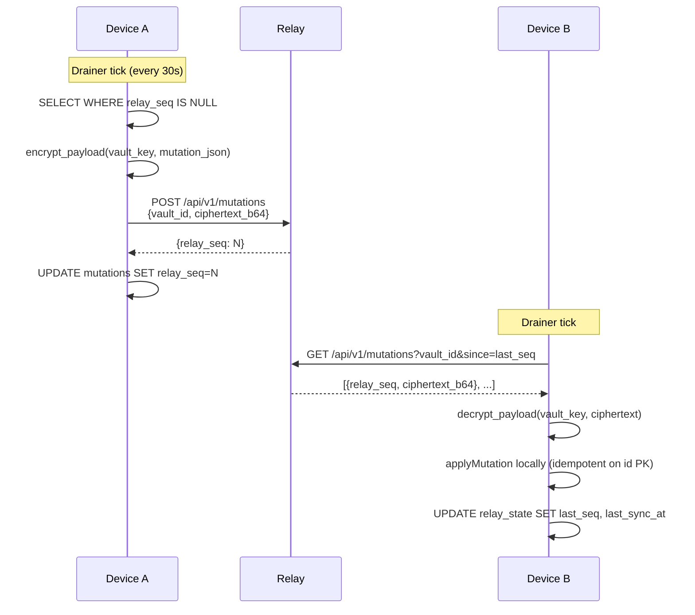
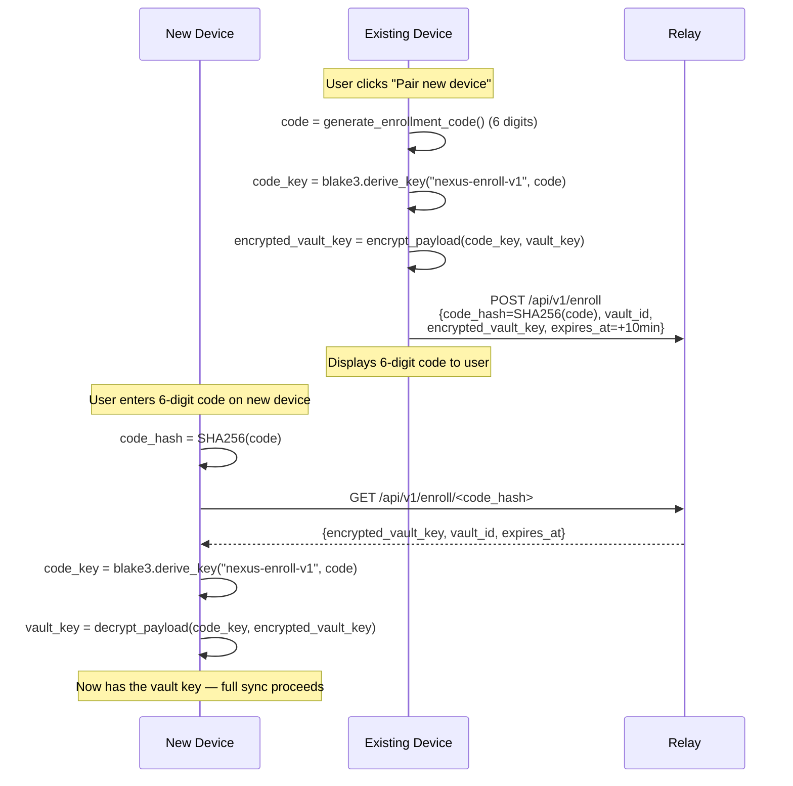

# Security Model

Consolidated reference for the cryptography and trust model underlying Nexus-V2. Previously scattered across `relay.md`, `user-guide.md` §11, and `architecture.md`; this file is now canonical and the other docs link here.

Verified against `src-tauri/src/crypto.rs`, `src-tauri/src/relay/`, and `relay-server/src/routes.rs`: 2026-05-28.

---

## Threat model

| Adversary | Capability | What they can / cannot do |
|---|---|---|
| **Attacker with the physical device** (no vault password) | Read disk, including the encrypted vault file. | **Cannot** read mail content, contacts, or mutations — vault is SQLCipher-encrypted. **Can** see file sizes. |
| **Attacker who steals an unlocked device** | Read everything the user can read while the OS session is open. | **Can** read everything. No protection against post-unlock theft beyond OS lock. |
| **Compromised relay operator** | Read every byte that transits the relay; tamper with it; correlate request timing. | **Cannot** read mutation content (each blob is XChaCha20-Poly1305 sealed under the per-vault key, which never leaves devices). **Can** see: blob counts, sizes, timestamps, relay sequence numbers, source IPs. **Can** delete or reorder blobs (detected via lamport clock + relay_seq monotonicity). |
| **Network adversary between device and relay** | Standard MITM. | **Cannot** decrypt blobs (E2EE). HTTPS recommended on top for forward secrecy and metadata privacy; not strictly required for content secrecy. |
| **Provider (Gmail/Outlook/IMAP server)** | Hosts the mail itself. | **Sees everything Nexus syncs from them.** Nexus does not re-encrypt mail before pushing — labels, drafts, sends go in cleartext to the provider. Local-only metadata (statuses, custom fields, notes, tags, priorities, stars, pins, mutes, flags, snoozes) **never leaves** the vault unless the user opts into relay sync. |
| **Attacker watching enrollment** | Sees a paired device-pairing flow. | **Cannot** derive the vault key from the 6-digit code without also obtaining the encrypted_vault_key blob from the relay within the 10-minute TTL — and the code never crosses the wire, only its SHA-256. See "Device enrollment" below. |

---

## Local vault encryption

**Implementation:** SQLCipher (rusqlite `bundled-sqlcipher` feature) wrapping the entire `vault.db` file. Every page is XChaCha20-encrypted at rest.

**Key:**
- Stored in the OS keychain via the `keyring` crate, keyed by vault ID.
- 32 bytes of random material generated once per vault.
- Exposed only via `get_vault_key_hex` IPC, which is gated to the local app (no relay leakage).

**What's encrypted:**
- All tables in `docs/database-reference.md`: messages, mutations, contacts, calendar, rules, templates, …
- All FTS5 indexes (`messages_fts`, `calendar_events_fts`) — but the index is built from plaintext columns inside the encrypted DB, so the SQLCipher-encrypted bytes do not leak content even if the file is read directly. Strengthening this further (true zero-knowledge encrypted index) is the EP-10 plan; see `docs/known-gaps.md` item 12.

**What's not encrypted (lives outside the vault):**
- `.eml` files on disk in local-first mode — these are in the user's chosen folder, **plaintext** RFC 822. Local-first users get filesystem visibility in exchange for vault-only encryption.
- The vault key in the OS keychain — protected by the OS keychain's own access control (Touch ID / login password on macOS).
- The `.nexus-mode` marker file (`traditional` or `local-first`) — plaintext, no sensitive content.

---

## Relay E2EE protocol

**Crypto:** XChaCha20-Poly1305 (AEAD). 24-byte random nonces, 32-byte vault key. See `src-tauri/src/crypto.rs:encrypt_payload`.

**Wire format:** each mutation blob is `nonce (24 bytes) || ciphertext (variable)`, base64-encoded for JSON transport.

**Protocol:**

**What the relay sees:**
- Source IP, request timestamps
- `vault_id` (a UUID — links blobs to a vault but reveals no content)
- Ciphertext byte counts
- Sequence numbers (assigned by relay; monotonic per vault_id)

**What the relay never sees:**
- The vault key (never transmitted)
- Mutation content (kind, payload, message bodies, etc.)
- Device-internal data (the device DB is never uploaded as a whole — only per-mutation blobs)

---

## Device enrollment

A new device joins a vault without the user typing out a 32-byte key. The flow uses a short-lived 6-digit code + relay-side ciphertext blob.

**Why this is safe:**
- The 6-digit code never crosses the wire — only its SHA-256 (`code_hash`).
- The vault key never crosses the wire in usable form — it's pre-encrypted by the existing device under a key derived from the code.
- 10-minute TTL bounds the attacker's window; even with the encrypted_vault_key + code_hash, brute-forcing 1,000,000 possible codes against `blake3.derive_key` is rate-limited by relay attempt-counter (`enroll_sessions.attempts`).
- BLAKE3's domain separator `"nexus-enroll-v1"` ensures the code can't be repurposed for other crypto.

**Verified entry points:** `src-tauri/src/crypto.rs:36-54` (`derive_code_key`, `code_hash`, `generate_enrollment_code`); `relay-server/src/routes.rs` (`POST /api/v1/enroll`, `GET /api/v1/enroll/:code_hash`).

---

## Vault key backup

The vault key is required to decrypt the vault. If the user loses every enrolled device, they lose the data.

Backup mechanisms (frontend exposes via `getVaultKeyHex` IPC):
- Hex string export — user can write to paper or save to a password manager
- QR code — same key, easier scan

**Loss scenarios:**
- Lose device + have a relay-enrolled second device → no problem, re-enroll a new device.
- Lose device + lose backup, no second enrolled device → vault is unrecoverable. **The relay cannot help** because the relay never holds the key.

---

## Provider OAuth tokens

Gmail and Outlook tokens are stored in the `accounts.access_token` / `accounts.refresh_token` columns inside the SQLCipher vault. They are:
- Encrypted at rest by SQLCipher
- Encrypted in transit by HTTPS to the provider
- **Never transmitted to the relay**

If the relay is compromised, no provider token is exposed. If the device is compromised (OS unlocked), tokens are exposed — same as any client.

---

## Known gaps in the model

| # | Item | Tracking |
|---|---|---|
| 1 | **FTS5 zero-knowledge** | Today `messages_fts` is plaintext inside the SQLCipher envelope. Acceptable against most threat models, but a database-level RAM attacker could enumerate. EP-10 plans to add a blind-index alternative. |
| 2 | **`.eml` plaintext in local-first** | A design choice — local-first explicitly trades vault-only encryption for filesystem visibility. Document clearly in `user-guide.md`. |
| 3 | **No rate limiting on enrollment** | `enroll_sessions.attempts` is incremented but there's no enforced lockout in `relay-server/src/routes.rs`. Mitigated by 10-minute TTL but should be hardened. |
| 4 | **No certificate pinning** | Standard HTTPS is sufficient for content secrecy (E2EE protects content), but pinning would block a malicious relay operator from MITM-replacing the relay URL. |

See `docs/known-gaps.md` for the full register of unfinished work.
